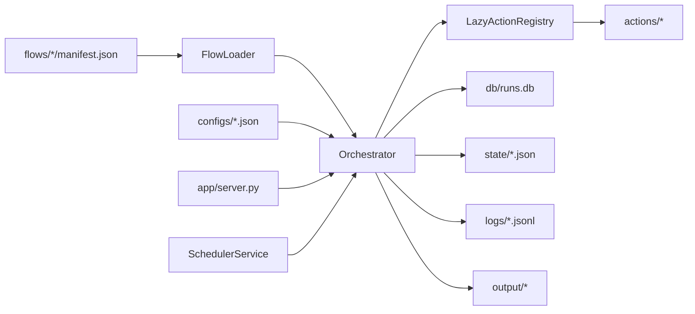

# Flujo Autónomo

> Orquestador local de procesos para PC: flows declarativos, ejecución trazable, scheduler, panel operativo y automatización visual con OCR/visión.


Flujo Autónomo es un sistema local para modelar y ejecutar procesos operativos sobre un PC. Cada proceso vive como un caso declarativo en `flows/`, se ejecuta por CLI o panel web, persiste historial en SQLite y deja evidencia en `state/`, `logs/` y `output/`.

El objetivo no es vender una plataforma abstracta: el repositorio muestra un producto inicial, ejecutable y auditable, con casos reales de filesystem, sistema, navegador, pantalla, OCR y UI automation.

## Resumen Ejecutivo

- Motor declarativo basado en `manifest.json`, con `when`, `transitions`, retries y límite de pasos por corrida.
- Panel local para ejecutar casos, editar configuración, revisar historial y activar scheduler.
- Persistencia operativa con SQLite, snapshots JSON y eventos JSONL.
- Acciones desacopladas para filesystem, sistema, pantalla, UI, HTTP, reglas y visión.
- Flujo visual avanzado con OCR, visión multimodal o modo híbrido.
- Validación liviana de manifests sin dependencias externas.
- Smoke test integral para validar motor, base de datos, scheduler y flows principales.

## Qué Demuestra

| Área | Evidencia concreta |
| --- | --- |
| Orquestación | `engine/orchestrator.py` ejecuta pasos, condiciones, transiciones, retries y persistencia incremental |
| Operación local | `app/server.py` entrega panel HTML sin framework pesado |
| Casos ejecutables | `flows/` contiene 11 procesos reales con manifiestos y contexto |
| Trazabilidad | cada corrida escribe SQLite, snapshot JSON, eventos JSONL y salidas detectadas |
| Automatización visual | OCR, bounding boxes, proveedor multimodal y UI dry-run |
| Mantenibilidad | registro de acciones perezoso y validador de manifests |

## Inicio Rápido

```bash
python -m venv .venv
source .venv/bin/activate   # Linux/Mac
# o .venv\Scripts\activate  # Windows
pip install -r requirements.txt
python -m app.server
```

Panel local:

```text
http://127.0.0.1:8787
```

CLI:

```bash
python -m engine.runner list
python -m engine.runner run flows/05_system_healthcheck
python -m engine.runner scheduler --interval 2
```

`list` no inicializa SQLite ni carga dependencias opcionales de acciones. Sirve para inspeccionar flows incluso antes de instalar todo el entorno.

## Validación

Valida manifests, acciones registradas y transiciones sin dependencias externas:

```bash
python scripts/validate_project.py
```

Prueba integral con SQLite, scheduler y flows reales:

```bash
python scripts/smoke_test.py
```

## Catálogo De Casos

| Caso | Familia | Propósito |
| --- | --- | --- |
| `01_screen_capture_analyze` | pantalla | captura pantalla y genera análisis local |
| `02_screen_watchdog_rules` | pantalla | evalúa reglas sobre estado visual |
| `03_folder_inventory` | filesystem | inventario y estadísticas de carpeta |
| `04_document_drop_pipeline` | documentos | pipeline de entrada documental |
| `05_system_healthcheck` | sistema | snapshot y reglas de salud del equipo |
| `06_process_watchdog` | sistema | observación de procesos por CPU/memoria |
| `07_browser_assisted_capture` | navegador | abre página local y captura evidencia |
| `08_ui_macro_recovery` | escritorio | macro mínima de recuperación de UI |
| `09_branching_document_router` | documentos | branching real según presencia de archivos |
| `10_screen_ocr_click_recovery` | pantalla | OCR + click visual o recuperación |
| `11_screen_tri_mode_operator` | pantalla | OCR, visión o híbrido con dry-run |

## Arquitectura En Una Frase

Un `manifest.json` declara pasos; el loader los convierte en definiciones; el orquestador resuelve condiciones, templates y transiciones; las acciones se cargan bajo demanda; cada corrida persiste estado, eventos y salidas.



## Documentación Del Repositorio

| Documento | Rol |
| --- | --- |
| [docs/ARQUITECTURA.md](docs/ARQUITECTURA.md) | diseño técnico y flujo de ejecución |
| [docs/FAMILIAS_Y_CASOS.md](docs/FAMILIAS_Y_CASOS.md) | taxonomía y catálogo de flows |
| [docs/OPERACION.md](docs/OPERACION.md) | guía de uso diario por CLI, panel y scheduler |
| [docs/CREAR_FLUJOS.md](docs/CREAR_FLUJOS.md) | contrato para crear nuevos manifests |
| [docs/SEGURIDAD.md](docs/SEGURIDAD.md) | límites, riesgos y controles operativos |
| [docs/VALIDACION.md](docs/VALIDACION.md) | checks locales y criterios de aceptación |
| [docs/TROUBLESHOOTING.md](docs/TROUBLESHOOTING.md) | fallas comunes y diagnóstico |
| [docs/MODOS_DE_ANALISIS_VISUAL.md](docs/MODOS_DE_ANALISIS_VISUAL.md) | OCR, visión e híbrido |

## Estructura

```text
/app        Panel local
/actions    Acciones ejecutables por los flows
/engine     Motor, loader, scheduler, templates y persistencia
/plugins    Analizadores extensibles
/flows      Casos ejecutables
/configs    Configuración por flow
/db         Base SQLite local
/logs       Eventos técnicos JSONL
/state      Snapshots completos de corrida
/output     Reportes y capturas generadas
/docs       Documentación técnica y operativa
```

## Modos Visuales

El caso `11_screen_tri_mode_operator` soporta:

- `analysis_mode = "ocr"`: extracción local con Tesseract.
- `analysis_mode = "vision"`: proveedor multimodal `mock`, `openai_compatible` u `ollama`.
- `analysis_mode = "hybrid"`: combina OCR y visión con prioridad configurable.

Para pruebas sin GUI real:

- `image_override` apunta a una imagen existente.
- `ui_dry_run = true` evita clicks reales.
- `skip_after_capture = true` evita captura posterior.

## Seguridad Operativa

Los flows pueden leer/escribir archivos, abrir URLs, capturar pantalla, controlar UI y lanzar procesos. Trátalos como automatizaciones locales confiables: revisa cualquier manifest recibido de terceros antes de ejecutarlo.

Controles actuales:

- `ui.launch_process` usa `shell=false` por defecto, valida comandos vacíos y soporta `dry_run`.
- Las salidas generadas quedan fuera de Git por `.gitignore`.
- `scripts/validate_project.py` revisa acciones registradas y transiciones antes de ejecutar.
- El panel se publica por defecto en `127.0.0.1`.

## Alcance Honesto

Este repositorio representa la primera versión operativa del sistema. Ya ejecuta flows reales y deja trazabilidad local, pero todavía no incluye RBAC, multiusuario, aislamiento fuerte de acciones, CI completo ni empaquetado instalable. La prioridad actual es mantener una base clara, reproducible y fácil de extender sin ocultar sus límites.
