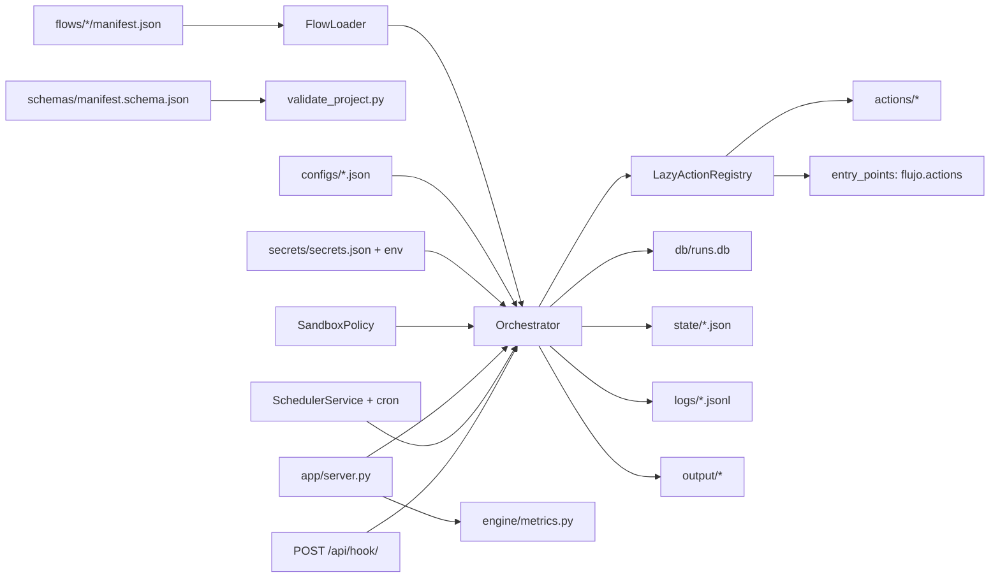

# Flujo Autónomo

> Orquestador local de procesos para PC: flows declarativos, ejecución trazable, scheduler con cron, panel operativo, métricas y automatización visual con OCR/visión.


Flujo Autónomo es un sistema local para modelar y ejecutar procesos operativos sobre un PC. Cada proceso vive como un caso declarativo en `flows/`, se ejecuta por CLI, panel web o webhook HTTP, persiste historial en SQLite y deja evidencia en `state/`, `logs/` y `output/`.

El objetivo no es vender una plataforma abstracta: el repositorio muestra un producto operativo con sandbox por flow, scheduler con cron, métricas y casos reales de filesystem, sistema, navegador, pantalla, OCR y UI automation.

## Resumen Ejecutivo

- Motor declarativo basado en `manifest.json`, con `when`, `transitions`, retries y límite de pasos por corrida.
- **Sandbox por flow:** allowlist de acciones, secretos requeridos, prefijos de ruta permitidos y máximo runtime.
- **Scheduler persistente** con expresiones cron de 5 campos y lock SQLite contra ejecuciones paralelas del mismo flow.
- **Panel local + API JSON + métricas Prometheus** y webhook de entrada autenticado por token.
- Persistencia operativa con SQLite, snapshots JSON y eventos JSONL.
- Acciones desacopladas para filesystem, sistema, pantalla, UI, HTTP, reglas, visión y notificaciones.
- **Plugins de terceros** vía entry-points `flujo.actions` (importlib.metadata).
- Validación con **JSON Schema** y suite de **77 tests pytest**.
- CI en GitHub Actions con `uv` (matriz Linux/Windows × Python 3.10–3.12) y job de smoke.
- Empaquetado moderno: `pyproject.toml` con extras `dev`, `schema` y entry-points para CLI.

## Qué Demuestra

| Área | Evidencia concreta |
| --- | --- |
| Orquestación | [engine/orchestrator.py](engine/orchestrator.py) ejecuta pasos, condiciones, transiciones, retries y persistencia incremental |
| Sandbox | [engine/sandbox.py](engine/sandbox.py) aplica allowlist, secretos y rutas permitidas antes y durante la corrida |
| Scheduler | [engine/scheduler.py](engine/scheduler.py) + [engine/cron.py](engine/cron.py) con lock persistente |
| Operación | [app/server.py](app/server.py) entrega panel + API JSON + métricas + webhook |
| Métricas | [engine/metrics.py](engine/metrics.py) expone `/api/metrics` y `/metrics` (Prometheus) |
| Casos ejecutables | [flows/](flows) contiene 11 procesos reales |
| Trazabilidad | cada corrida escribe SQLite, snapshot JSON, eventos JSONL y outputs |
| Mantenibilidad | JSON Schema + pytest + CI + ruff |

## Inicio Rápido

### Con uv (recomendado)

```bash
uv sync --extra dev --extra schema
uv run python -m app.server
```

### Con pip

```bash
python -m venv .venv
source .venv/bin/activate     # Windows: .venv\Scripts\activate
pip install -e ".[dev,schema]"
python -m app.server
```

Panel local:

```text
http://127.0.0.1:8787
```

CLI tras instalar el paquete:

```bash
flujo list
flujo run flows/05_system_healthcheck
flujo scheduler --interval 2
```

O sin instalar:

```bash
python -m engine.runner list
python -m engine.runner run flows/05_system_healthcheck
```

`list` no inicializa SQLite ni carga dependencias opcionales. Sirve para inspeccionar flows incluso antes de instalar todo el entorno.

## Validación

Tres niveles, de barato a caro:

```bash
python scripts/validate_project.py   # JSON Schema + acciones + transitions
pytest                                # 77 tests unitarios + integración
python scripts/smoke_test.py          # corrida real de flows representativos
```

## Catálogo De Casos

| Caso | Familia | Propósito |
| --- | --- | --- |
| `01_screen_capture_analyze` | pantalla | captura pantalla y genera análisis local |
| `02_screen_watchdog_rules` | pantalla | evalúa reglas sobre estado visual |
| `03_folder_inventory` | filesystem | inventario y estadísticas de carpeta |
| `04_document_drop_pipeline` | documentos | pipeline de entrada documental |
| `05_system_healthcheck` | sistema | snapshot y reglas de salud del equipo |
| `06_process_watchdog` | sistema | observación de procesos por CPU/memoria |
| `07_browser_assisted_capture` | navegador | abre página local y captura evidencia |
| `08_ui_macro_recovery` | escritorio | macro mínima de recuperación de UI |
| `09_branching_document_router` | documentos | branching real según presencia de archivos |
| `10_screen_ocr_click_recovery` | pantalla | OCR + click visual o recuperación |
| `11_screen_tri_mode_operator` | pantalla | OCR, visión o híbrido con dry-run |

## Arquitectura En Una Frase

Un `manifest.json` declara pasos y política de sandbox; el loader los convierte en definiciones; el orquestador resuelve condiciones, templates y transiciones aplicando la política; las acciones se cargan bajo demanda (built-in o entry-points externos); cada corrida persiste estado, eventos, salidas y métricas.



## Documentación Del Repositorio

| Documento | Rol |
| --- | --- |
| [docs/ARQUITECTURA.md](docs/ARQUITECTURA.md) | diseño técnico y flujo de ejecución |
| [docs/FAMILIAS_Y_CASOS.md](docs/FAMILIAS_Y_CASOS.md) | taxonomía y catálogo de flows |
| [docs/OPERACION.md](docs/OPERACION.md) | guía de uso diario por CLI, panel, scheduler y webhook |
| [docs/CREAR_FLUJOS.md](docs/CREAR_FLUJOS.md) | contrato para crear nuevos manifests |
| [docs/SEGURIDAD.md](docs/SEGURIDAD.md) | sandbox por flow, secretos y modelo de confianza |
| [docs/VALIDACION.md](docs/VALIDACION.md) | JSON Schema, pytest, CI y criterios de aceptación |
| [docs/METRICAS.md](docs/METRICAS.md) | endpoints, dashboard y formato Prometheus |
| [docs/INTEGRACIONES.md](docs/INTEGRACIONES.md) | webhook de entrada y notificaciones de salida |
| [docs/EXTENSION.md](docs/EXTENSION.md) | publicar acciones de terceros vía entry-points |
| [docs/TROUBLESHOOTING.md](docs/TROUBLESHOOTING.md) | fallas comunes y diagnóstico |
| [docs/MODOS_DE_ANALISIS_VISUAL.md](docs/MODOS_DE_ANALISIS_VISUAL.md) | OCR, visión e híbrido |

## Estructura

```text
/app          Panel local + API JSON
/actions      Acciones ejecutables por los flows
/engine       Motor: loader, orquestador, sandbox, scheduler, cron, métricas, secretos
/plugins      Analizadores extensibles
/flows        Casos ejecutables
/configs      Configuración por flow (no secretos)
/secrets      Bóveda local (ignorada por git)
/schemas      JSON Schema del manifest
/db           Base SQLite local
/logs         Eventos técnicos JSONL
/state        Snapshots completos de corrida
/output       Reportes y capturas generadas
/tests        Suite pytest
/docs         Documentación técnica y operativa
/.github      Workflows de CI
```

## Modos Visuales

El caso `11_screen_tri_mode_operator` soporta:

- `analysis_mode = "ocr"`: extracción local con Tesseract.
- `analysis_mode = "vision"`: proveedor multimodal `mock`, `openai_compatible` u `ollama`.
- `analysis_mode = "hybrid"`: combina OCR y visión con prioridad configurable.

Para pruebas sin GUI real:

- `image_override` apunta a una imagen existente.
- `ui_dry_run = true` evita clicks reales.
- `skip_after_capture = true` evita captura posterior.

## Seguridad Operativa

Los flows pueden leer/escribir archivos, abrir URLs, capturar pantalla, controlar UI y lanzar procesos. La política se declara en el propio manifest:

```json
{
  "id": "auditoria_segura",
  "name": "Auditoría",
  "allowed_actions": ["filesystem.list_directory", "filesystem.write_json"],
  "allowed_paths": ["data/auditorias", "output/reports"],
  "required_secrets": ["AUDIT_API_KEY"],
  "max_runtime_seconds": 60,
  "steps": [...]
}
```

El orquestador rechaza acciones fuera de `allowed_actions`, valida que los `params` con rutas estén bajo `allowed_paths`, exige los `required_secrets` antes de empezar y aborta si la corrida supera `max_runtime_seconds`. Detalle en [docs/SEGURIDAD.md](docs/SEGURIDAD.md).

Otros controles:

- `ui.launch_process` usa `shell=false` por defecto y soporta `dry_run`.
- Salidas generadas y `secrets/` quedan fuera de Git por `.gitignore`.
- El panel se publica por defecto en `127.0.0.1`.
- El webhook `/api/hook/<folder>` exige el token `FLUJO_WEBHOOK_TOKEN`; si no está definido, el endpoint queda deshabilitado.

## Alcance Honesto

Esta versión 0.2.0 añade sandbox, cron persistente, métricas, JSON Schema, suite de tests, CI y entry-points. Todavía no incluye RBAC multiusuario, aislamiento OS-level por proceso, ni empaquetado en instalador binario. La prioridad sigue siendo mantener una base clara, reproducible y fácil de extender sin ocultar sus límites.
