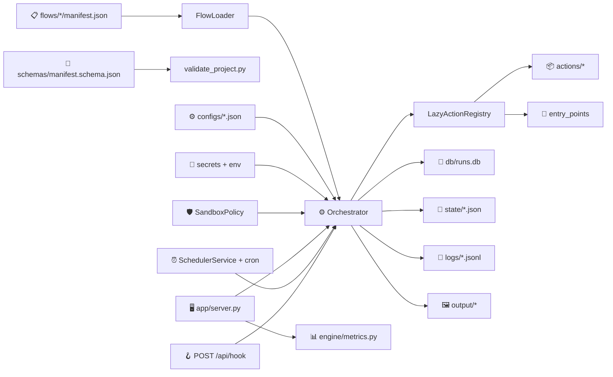

<br>
<div align="center">

# 🤖 Flujo Autónomo

### Orquestador local de procesos para PC

**Flows declarativos · Panel 3-tabs · Sandbox por flow · Scheduler con cron · OCR / visión**


[](https://github.com/vladimiracunadev-create/flujo-autonomo-repo/actions/workflows/ci.yml)
[](LICENSE)
[](CHANGELOG.md)
[]()

</div>


---

## 🧭 Resumen Ejecutivo

Flujo Autónomo resuelve un problema concreto: muchas tareas operativas en un PC son **repetitivas, frágiles y opacas** — capturar pantalla, mover archivos, vigilar procesos, levantar reportes, automatizar UIs. Este producto las modela como **flows declarativos en JSON**, los ejecuta desde un panel local en `127.0.0.1`, deja **trazabilidad completa** en SQLite + snapshots + eventos JSONL, y los puede dejar corriendo programados con cron.

El recorrido del operador cubre tres zonas claras dentro de un único panel:

```text
▶ Ejecutar  →  ⏰ Programadas  →  📜 Histórico
```

- **▶ Ejecutar**: cards por flow con un clic — corre en tiempo real, muestra estado live, link al detalle.
- **⏰ Programadas**: las mismas acciones con scheduler intervalo o cron, lock contra ejecuciones paralelas.
- **📜 Histórico**: tabla buscable de todas las corridas con duración, badge de estado y detalle con capturas inline.

> [!IMPORTANT]
> La lectura correcta del repo hoy es: **producto operativo de un solo usuario en su PC**. La trazabilidad, el sandbox por flow y la suite de tests son reales; pero todavía no hay RBAC multiusuario, ni aislamiento OS-level por proceso, ni instalador binario. La prioridad sigue siendo claridad y reproducibilidad antes que cobertura empresarial.

---

## 📊 Estado del Producto · v0.3.0

| Capa | Estado | Qué demuestra hoy | Evidencia principal |
| --- | --- | --- | --- |
| Panel 3-tabs | 🟢 Operativo | Ejecutar / programar / revisar todo desde un mismo localhost | [app/server.py](app/server.py) |
| Motor declarativo | 🟢 Operativo | Manifest → pasos → transitions → persistencia incremental | [engine/orchestrator.py](engine/orchestrator.py) |
| Sandbox por flow | 🟢 Operativo | allowed_actions · required_secrets · allowed_paths · max_runtime | [engine/sandbox.py](engine/sandbox.py) |
| Scheduler + cron | 🟢 Operativo | Cron 5 campos sin deps + lock SQLite contra paralelas | [engine/scheduler.py](engine/scheduler.py), [engine/cron.py](engine/cron.py) |
| Métricas | 🟢 Operativo | `/metrics` Prometheus + `/api/metrics` JSON + dashboard HTML | [engine/metrics.py](engine/metrics.py) |
| Webhooks IN | 🟢 Operativo | `POST /api/hook/<folder>` con token `FLUJO_WEBHOOK_TOKEN` | [app/server.py](app/server.py) |
| Notificaciones OUT | 🟢 Operativo | Acción `notify.send` con backends log/file/webhook | [actions/notify.py](actions/notify.py) |
| Plugins de terceros | 🟢 Operativo | Entry-points `flujo.actions` (importlib.metadata) | [engine/action_registry.py](engine/action_registry.py) |
| Casos ejecutables | 🟢 11 reales | Filesystem, sistema, pantalla, OCR, visión, branching | [flows/](flows) |
| Suite pytest | 🟢 82 verde | Unitarios + integración + panel HTTP live | [tests/](tests) |
| CI | 🟢 Operativo | uv · matriz Linux/Windows × Python 3.10–3.12 · ruff · smoke | [.github/workflows/ci.yml](.github/workflows/ci.yml) |
| Empaquetado | 🟢 Operativo | `pyproject.toml` con extras `dev`/`schema` y CLI scripts | [pyproject.toml](pyproject.toml) |
| Multiusuario / RBAC | 🔴 No | Diseño actual asume un operador local | — |
| Aislamiento OS-level | 🟡 Parcial | Sandbox a nivel orquestador, no a nivel proceso | [docs/SEGURIDAD.md](docs/SEGURIDAD.md) |

---

## ⚡ Inicio rápido

### Con uv (recomendado)

```bash
uv sync --extra dev --extra schema
uv run python -m app.server
```

### Con pip

```bash
python -m venv .venv
source .venv/bin/activate     # Windows: .venv\Scripts\activate
pip install -e ".[dev,schema]"
python -m app.server
```

Abre el panel:

```text
http://127.0.0.1:8787
```

CLI tras instalar el paquete:

```bash
flujo list
flujo run flows/05_system_healthcheck
flujo scheduler --interval 2
flujo-validate
```

---

## 🎯 Demo de 5 minutos

1. 🟢 Levanta el panel (`uv run python -m app.server`).
2. ▶ Tab **Ejecutar**: hacé clic en `Healthcheck del sistema` — verás el badge `running` y al cabo de medio segundo un `completed` con link al detalle.
3. 📜 Tab **Histórico**: abre el detalle del run anterior — ves los 3 pasos, sus duraciones, los datos capturados y el reporte JSON generado en `output/reports/`.
4. ⏰ Tab **Programadas**: en `Inventario de carpeta` activa el scheduler con cron `*/15 * * * *` — guarda y cambia a Histórico, en 15 minutos verás corridas automáticas.
5. 📊 Click en **Métricas**: KPI cards con totales, top acciones lentas y por flow.
6. 🛡️ Abre [flows/05_system_healthcheck/manifest.json](flows/05_system_healthcheck/manifest.json) y agrega `"allowed_actions": ["system.snapshot_system","rules.evaluate","filesystem.write_json"]`. Ejecuta — verás cómo el sandbox sólo permite esas 3.
7. 🔌 Define `FLUJO_WEBHOOK_TOKEN` y dispara el flow vía `curl -X POST -H "X-Flujo-Token: $TOKEN" http://127.0.0.1:8787/api/hook/05_system_healthcheck`.

---

## 🗂️ Catálogo de Casos

| Caso | Familia | Propósito |
| --- | --- | --- |
| `📷 01_screen_capture_analyze` | pantalla | captura pantalla y genera análisis local |
| `🌐 02_screen_capture_browser` | navegador | captura DOM con Playwright headless (sin escritorio) |
| `📁 03_folder_inventory` | filesystem | inventario y estadísticas de carpeta |
| `📄 04_document_drop_pipeline` | documentos | pipeline de entrada documental |
| `🖥️ 05_system_healthcheck` | sistema | snapshot y reglas de salud del equipo |
| `⚙️ 06_process_watchdog` | sistema | observación de procesos por CPU/memoria |
| `🌐 07_browser_assisted_capture` | navegador | abre página local y captura evidencia |
| `🖱️ 08_ui_macro_recovery` | escritorio | macro mínima de recuperación de UI |
| `🔀 09_branching_document_router` | documentos | branching real según presencia de archivos |
| `🔍 10_screen_ocr_click_recovery` | pantalla | OCR + click visual o recuperación |
| `🎯 11_screen_tri_mode_operator` | pantalla | OCR, visión o híbrido con dry-run |

---

## 🏗️ Arquitectura en una frase

Un `manifest.json` declara pasos y política de sandbox; el loader los convierte en definiciones; el orquestador resuelve condiciones, templates y transiciones aplicando la política; las acciones se cargan bajo demanda (built-in o entry-points externos); cada corrida persiste estado, eventos, salidas y métricas.



---

## 🛡️ Seguridad operativa

Los flows pueden leer/escribir archivos, abrir URLs, capturar pantalla, controlar UI y lanzar procesos. La política se declara directamente en el manifest:

```json
{
  "id": "auditoria_segura",
  "name": "Auditoría",
  "allowed_actions": ["filesystem.list_directory", "filesystem.write_json"],
  "allowed_paths": ["data/auditorias", "output/reports"],
  "required_secrets": ["AUDIT_API_KEY"],
  "max_runtime_seconds": 60,
  "steps": [...]
}
```

El orquestador rechaza acciones fuera de `allowed_actions`, valida que los paths estén bajo `allowed_paths`, exige los `required_secrets` antes de empezar y aborta si la corrida supera `max_runtime_seconds`. Detalle en [docs/SEGURIDAD.md](docs/SEGURIDAD.md).

> [!WARNING]
> El webhook entrante (`POST /api/hook/<folder>`) está **deshabilitado por defecto**: sólo acepta peticiones cuando `FLUJO_WEBHOOK_TOKEN` está definido y el header `X-Flujo-Token` coincide. Si lo expones más allá de localhost, ponlo detrás de un reverse proxy con TLS.

---

## ✅ Validación

Tres niveles, de barato a caro:

```bash
python scripts/validate_project.py   # JSON Schema + acciones + transitions
pytest                                # 82 tests unitarios + integración
python scripts/smoke_test.py          # corrida real de flows representativos
```

Detalle en [docs/VALIDACION.md](docs/VALIDACION.md).

---

## 📚 Documentación

| Documento | Rol |
| --- | --- |
| [📐 ARQUITECTURA.md](docs/ARQUITECTURA.md) | diseño técnico y flujo de ejecución |
| [🗂️ FAMILIAS_Y_CASOS.md](docs/FAMILIAS_Y_CASOS.md) | taxonomía y catálogo de flows |
| [📖 OPERACION.md](docs/OPERACION.md) | guía de uso diario por CLI, panel, scheduler y webhook |
| [✏️ CREAR_FLUJOS.md](docs/CREAR_FLUJOS.md) | contrato para crear nuevos manifests |
| [🛡️ SEGURIDAD.md](docs/SEGURIDAD.md) | sandbox por flow, secretos y modelo de confianza |
| [✅ VALIDACION.md](docs/VALIDACION.md) | JSON Schema, pytest, CI y criterios de aceptación |
| [📊 METRICAS.md](docs/METRICAS.md) | endpoints, dashboard y formato Prometheus |
| [🔌 INTEGRACIONES.md](docs/INTEGRACIONES.md) | webhook de entrada y notificaciones de salida |
| [🧩 EXTENSION.md](docs/EXTENSION.md) | publicar acciones de terceros vía entry-points |
| [🐛 TROUBLESHOOTING.md](docs/TROUBLESHOOTING.md) | fallas comunes y diagnóstico |
| [👁️ MODOS_DE_ANALISIS_VISUAL.md](docs/MODOS_DE_ANALISIS_VISUAL.md) | OCR, visión e híbrido |
| [📝 CHANGELOG.md](CHANGELOG.md) | historial de versiones |

---

## 🗃️ Estructura

```text
/app          🖥️  Panel local + API JSON
/actions      📦 Acciones ejecutables por los flows
/engine       ⚙️  Motor: loader, orquestador, sandbox, scheduler, cron, métricas, secretos
/plugins      🧩 Analizadores extensibles
/flows        📋 Casos ejecutables
/configs      ⚙️  Configuración por flow (no secretos)
/secrets      🔐 Bóveda local (ignorada por git)
/schemas      🧪 JSON Schema del manifest
/db           💾 Base SQLite local
/logs         📜 Eventos técnicos JSONL
/state        📂 Snapshots completos de corrida
/output       🖼️  Reportes y capturas generadas
/tests        🧪 Suite pytest
/docs         📚 Documentación técnica y operativa
/.github      🤖 Workflows de CI
```

---

## 👁️ Modos visuales

El caso `🎯 11_screen_tri_mode_operator` soporta:

- **OCR puro** (`analysis_mode = "ocr"`): extracción local con Tesseract.
- **Visión multimodal** (`analysis_mode = "vision"`): proveedor `mock`, `openai_compatible` u `ollama`.
- **Híbrido** (`analysis_mode = "hybrid"`): combina OCR y visión con prioridad configurable.

Para pruebas sin GUI real:

- 🖼️ `image_override` apunta a una imagen existente.
- 🚫 `ui_dry_run = true` evita clicks reales.
- ⏭️ `skip_after_capture = true` evita captura posterior.

---

<div align="center">

**[⬆ Volver arriba](#-flujo-autónomo)** ·
**[📝 Changelog](CHANGELOG.md)** ·
**[🐛 Issues](https://github.com/vladimiracunadev-create/flujo-autonomo-repo/issues)**

Hecho con 🐍 Python · 💾 SQLite · 🛡️ Sandbox por flow · ☕ Café local

</div>
