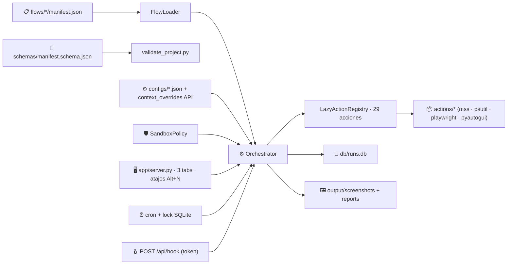

<br>
<div align="center">

# 🤖 Automa

### Control local de tareas y acciones efectivas sobre Windows

**Abre ventanas reales · Llena formularios · Captura escritorio y DOM · Audita el equipo · Todo declarativo en JSON**


[](https://github.com/vladimiracunadev-create/automa-pc/actions/workflows/ci.yml)
[](https://github.com/vladimiracunadev-create/automa-pc/actions/workflows/security.yml)
[](https://github.com/vladimiracunadev-create/automa-pc/actions/workflows/workflow-security.yml)
[](LICENSE)
[](CHANGELOG.md)
[](SECURITY.md)

</div>


---

## 🎯 ¿Para qué existe este repositorio?

Para **ejecutar acciones efectivas sobre el escritorio Windows** desde un panel local en `127.0.0.1`. La idea no es solo "ejecutar scripts en orden" — sino **abrir ventanas reales, interactuar con ellas, capturar evidencia y dejar trazabilidad**.

El objetivo a largo plazo: tener control declarativo sobre tareas operativas reales del PC — abrir aplicaciones, llenar formularios, automatizar pipelines de datos visuales, escalar de auditoría pasiva a operación activa.

> [!IMPORTANT]
> **Filtro de aceptación**: los casos que solo emiten JSON con datos del sistema (inventarios, healthcheck) son **utilidades básicas** — entran en el mínimo. Los casos que **abren ventanas, interactúan con DOM real, hacen capturas con datos contextualizados** son los que justifican el producto. La dirección de evolución apunta a más robustez visual e interactiva, no más reportes pasivos.

---

## 🗂️ Catálogo actual · 7 flows operativos

Clasificados por su nivel de interacción con el sistema:

### 🟢 Operaciones avanzadas (abren ventana real)

| Caso | Familia | Qué hace efectivamente |
| --- | --- | --- |
| **`📷 01_screen_capture_analyze`** | pantalla | Captura el escritorio Windows completo (mss → PNG 1920×1080) y analiza brillo/RGB. |
| **`🌐 02_screen_capture_browser`** | navegador | Lanza Chromium headless con Playwright y captura el DOM renderizado de una URL configurable (input inline + atajo `Alt+2`). |
| **`📋 07_browser_form_filler`** | navegador | **Operación más avanzada del repo**: lanza Chromium *visible*, navega al formulario de 10 campos `data/web/form_demo.html`, elige uno de 100 registros del seed sin repetir, los rellena uno por uno con `slow_mo` (observable a ojo), submit, valida JS y guarda payload. |

### 🟡 Utilidades sobre el equipo (solo lectura · solo JSON)

| Caso | Familia | Qué hace |
| --- | --- | --- |
| `📁 03_folder_inventory` | filesystem | Lista archivos de una carpeta (input inline + atajo `Alt+3` con modal selector). |
| `📄 04_document_drop_pipeline` | documentos | Resume archivos `.txt`/`.md`/`.log`/`.csv`/`.json` de una carpeta. |
| `🖥️ 05_system_healthcheck` | sistema | Snapshot CPU/RAM/disco con `psutil` + reglas de alerta. |
| `⚙️ 06_process_watchdog` | sistema | Top 10 procesos con alertas por umbral de RAM/CPU. |

> Los flows 03–06 son **utilidades correctas pero pobres en valor**. La inversión próxima va a flows del bloque 🟢 (más interacción real, no más telemetría pasiva).

---

## 🚀 El panel en 3 tabs

```text
▶ Ejecutar         ⏰ Programadas         📜 Histórico
```

- **▶ Ejecutar** — cards por flow. Click ejecuta en tiempo real con progreso paso-a-paso. Atajos `Alt+1..Alt+7`.
- **⏰ Programadas** — scheduler con intervalo o cron de 5 campos. Lock SQLite contra ejecuciones paralelas.
- **📜 Histórico** — todas las corridas con filtro, badge de estado, duración y link al detalle.

**Detalle de cada run** muestra la imagen capturada en hero, un **resumen inteligente legible** (no JSON crudo), pasos clickeables con resultado completo en modal, y el contexto/eventos en `<details>` colapsables.

**Dashboard de cada flow** (`/flow/<folder>`) tiene **grid visual de las últimas 12 corridas** con preview real de cada una (PNG si hay, claves del JSON si no).

---

## ⚡ Inicio rápido

### Con uv (recomendado)

```bash
uv sync --extra dev --extra schema
python -m playwright install chromium    # necesario para flows 02 y 07
uv run python -m app.server
```

### Con pip

```bash
python -m venv .venv
.venv\Scripts\activate
pip install -e ".[dev,schema]"
python -m playwright install chromium
python -m app.server
```

Abrí: <http://127.0.0.1:8787>

CLI tras instalar:

```bash
flujo list                                     # lista flows
flujo run flows/05_system_healthcheck          # corre uno
flujo scheduler --interval 2                   # scheduler en bucle
automa-validate                                 # JSON Schema + acciones + transitions
```

---

## 🎯 Demo de 5 minutos

1. 🟢 Levantá el panel.
2. 📋 Tab **Ejecutar** → atajo `Alt+7` → flow `browser_form_filler`. **Mirá**: se abre una ventana de Chromium, navega al form, **rellena los 10 campos uno por uno** con `slow_mo=250ms` (observable), submit, validación JS y cierra. Output JSON en `output/reports/form_submission_*.json` con el record elegido + tracking.
3. 🌐 Volvé al panel → atajo `Alt+2` → modal pide URL → escribe `https://github.com` o tu intranet → captura PNG real del DOM (sin pestañas en tu Chrome).
4. 📜 Tab **Histórico** → click el último run del flow 07 → verás los 10 datos enviados como **lista legible** (no JSON crudo) + el `submitted_payload` que la página renderizó.
5. ⏰ Tab **Programadas** → activá el flow 05 con cron `*/15 * * * *` → en 15 min ya tenés telemetría histórica del PC en SQLite.

---

## 🏗️ Arquitectura en una frase

Un `manifest.json` declara pasos y política de sandbox; el orquestador resuelve condiciones, templates y transiciones aplicando la política; las acciones se cargan bajo demanda; cada corrida persiste estado, eventos, salidas y métricas.



---

## 📊 Estado del producto · v0.4.0

| Capa | Estado | Evidencia |
| --- | --- | --- |
| Panel 3-tabs + atajos teclado | 🟢 Operativo | [app/server.py](app/server.py) |
| Motor declarativo | 🟢 Operativo | [engine/orchestrator.py](engine/orchestrator.py) |
| Sandbox por flow | 🟢 Operativo | [engine/sandbox.py](engine/sandbox.py), [docs/SEGURIDAD.md](docs/SEGURIDAD.md) |
| Scheduler con cron + lock | 🟢 Operativo | [engine/scheduler.py](engine/scheduler.py) |
| Override de context vía API | 🟢 Operativo | `POST /api/run/<folder>` con body `{"context_overrides": {...}}` |
| Métricas Prometheus + dashboard | 🟢 Operativo | [engine/metrics.py](engine/metrics.py) |
| Webhooks IN | 🟢 Operativo | `POST /api/hook/<folder>` con `AUTOMA_WEBHOOK_TOKEN` |
| Plugins de terceros (entry-points) | 🟢 Operativo | [engine/action_registry.py](engine/action_registry.py) |
| **Casos avanzados (ventana real)** | 🟢 3 flows · 01 02 07 | [flows/](flows) |
| **Casos utilitarios (solo JSON)** | 🟡 4 flows · 03 04 05 06 | mínimo aceptable, no foco |
| Suite pytest | 🟢 79 verde | [tests/](tests) |
| CI: lint + tests + smoke + security + docs | 🟢 Operativo | [.github/workflows/](.github/workflows) |
| CI hardening (SHA pin + zizmor + Trojan Source) | 🟢 Operativo | [SECURITY.md](SECURITY.md) §CI · [workflow-security.yml](.github/workflows/workflow-security.yml) |
| Multiusuario / RBAC | 🔴 No | un operador local |
| Aislamiento OS-level | 🟡 Sandbox declarativo, no proceso | [docs/SEGURIDAD.md](docs/SEGURIDAD.md) |

---

## ⌨️ Atajos del panel

| Tecla | Acción |
| --- | --- |
| `Alt+1`…`Alt+7` | Ejecutar flow N |
| `Alt+E` / `Alt+P` / `Alt+H` | Tab Ejecutar / Programadas / Histórico |
| `Alt+M` | Dashboard de Métricas |
| `?` o `F1` | Modal de ayuda |
| `Esc` | Cerrar modal |

Los flows 02, 03 y 07 abren un **modal especial pidiendo input** cuando se disparan por atajo (URL, ruta de carpeta, etc).

---

## 🛡️ Seguridad

Dos frentes distintos, cada uno con su política dedicada:

### 1. Runtime — sandbox declarativo por flow

Cada flow declara su política directamente:

```json
{
  "id": "auditoria_segura",
  "allowed_actions": ["filesystem.list_directory", "filesystem.write_json"],
  "allowed_paths": ["data/auditorias", "output/reports"],
  "required_secrets": ["AUDIT_API_KEY"],
  "max_runtime_seconds": 60,
  "steps": [...]
}
```

El motor rechaza acciones fuera del allowlist, valida prefijos de paths y exige los secrets antes de iniciar. **Detalle completo → [docs/SEGURIDAD.md](docs/SEGURIDAD.md)**.

### 2. Supply chain — hardening del CI/CD

Este repo ejecuta acciones reales sobre tu escritorio Windows. Un commit malicioso fusionado a `main` se traduce en RCE local en cuanto haya `git pull`. Por eso el CI se trata como frontera de confianza con **12 capas de defensa**:

| # | Capa | Garantiza |
| --- | --- | --- |
| 1 | SHA pin en toda acción third-party | El código que se ejecuta es el aprobado al mergear |
| 2 | `pin-check` con parser YAML real | Imposible introducir un `uses:` sin SHA sin que falle CI |
| 3 | Allowlist vacía + excepciones documentadas | Cero excepciones silenciosas |
| 4 | `persist-credentials: false` | Token no queda accesible a steps posteriores |
| 5 | Permisos mínimos (`contents: read`) | Step comprometido no puede empujar a `main` |
| 6 | `concurrency: cancel-in-progress` | Ventana temporal de tokens reducida |
| 7 | Triggers prohibidos (`pull_request_target`) | Cierra el vector #1 de GitHub Actions |
| 8 | CodeQL `security-extended` | SAST sobre Python (CWE Top 25) |
| 9 | `actionlint` + `zizmor==1.5.2` | SAST sobre los propios workflows YAML |
| 10 | `detect-secrets==1.5.0` filesystem + 50 commits | Secretos commiteados detectados aunque se borren después |
| 11 | Trojan Source + ofuscación + URLs de exfil | Payloads que pasarían review humana |
| 12 | `pip-audit==2.7.3` (soft PR / hard main) | `main` sin CVEs publicadas |

> [!IMPORTANT]
> **Política completa con modelo de amenaza, justificación de cada capa y qué NO garantiza → [SECURITY.md §Hardening del CI/CD](SECURITY.md#hardening-del-cicd-supply-chain)**

Política de reporte de vulnerabilidades también en [SECURITY.md](SECURITY.md).

> [!WARNING]
> El webhook entrante está **deshabilitado por defecto** y requiere `AUTOMA_WEBHOOK_TOKEN`. Si lo expones más allá de localhost, ponelo detrás de un reverse proxy con TLS.

---

## ✅ Validación local antes de pushear

```bash
uv run pytest                          # 79 tests
uv run ruff check .                    # lint
uv run python scripts/validate_project.py   # JSON Schema + acciones
```

Las tres deben pasar. CI corre lo mismo + `security.yml` (CodeQL `security-extended`, detect-secrets sobre filesystem **e historial**, Trojan Source CVE-2021-42574, ofuscación, exfiltración, pip-audit) + `workflow-security.yml` (actionlint + zizmor + pin-check sobre los propios YAML) + `markdown-docs.yml` (links rotos) + `dependency-hygiene.yml`.

Toda acción third-party va pinned a SHA — política completa en [SECURITY.md](SECURITY.md) §"Hardening del CI/CD".

---

## 📚 Documentación

### Operación

| Documento | Para qué |
| --- | --- |
| [📖 docs/MANUAL_USUARIO.md](docs/MANUAL_USUARIO.md) | Manual con casos resueltos en Windows real |
| [📕 RUNBOOK.md](RUNBOOK.md) | Procedimientos del día a día (reset, locks, queries) |
| [📊 docs/METRICAS.md](docs/METRICAS.md) | Endpoints, dashboard y formato Prometheus |
| [🔌 docs/INTEGRACIONES.md](docs/INTEGRACIONES.md) | Webhooks IN y notificaciones OUT |

### Diseño

| Documento | Para qué |
| --- | --- |
| [📐 docs/ARQUITECTURA.md](docs/ARQUITECTURA.md) | Diseño técnico y flujo de ejecución |
| [🗂️ docs/FAMILIAS_Y_CASOS.md](docs/FAMILIAS_Y_CASOS.md) | Catálogo y matriz de compatibilidad |
| [✏️ docs/CREAR_FLUJOS.md](docs/CREAR_FLUJOS.md) | Contrato para escribir un flow nuevo |
| [🛡️ docs/SEGURIDAD.md](docs/SEGURIDAD.md) | Sandbox, secretos, modelo de confianza |
| [✅ docs/VALIDACION.md](docs/VALIDACION.md) | JSON Schema, pytest, CI, criterios |
| [🧩 docs/EXTENSION.md](docs/EXTENSION.md) | Publicar acciones de terceros vía entry-points |
| [🐛 docs/TROUBLESHOOTING.md](docs/TROUBLESHOOTING.md) | Fallas comunes y diagnóstico |

### Proyecto

| Documento | Para qué |
| --- | --- |
| [📝 CHANGELOG.md](CHANGELOG.md) | Historial de versiones (Keep a Changelog) |
| [🤝 CONTRIBUTING.md](CONTRIBUTING.md) | Cómo contribuir |
| [🛡️ SECURITY.md](SECURITY.md) | Política de reporte de vulnerabilidades |
| [📜 LICENSE](LICENSE) | MIT |

---

## 🗃️ Estructura del repo

```text
/app          🖥️  Panel local + API JSON
/actions      📦 mss · psutil · playwright · pyautogui · webbrowser · ...
/engine       ⚙️  Motor: orquestador · sandbox · scheduler · cron · métricas · secretos
/flows        📋 7 casos operativos
/data
  /web        🌐 HTML local (form_demo · control_page)
  /seeds      🧬 100 registros del flow 07 + tracking de usados
  /inbox      📥 Carpeta de ejemplo para flow 03/04
/configs      ⚙️  Contexto persistido por flow
/secrets      🔐 Bóveda local (ignorada por git)
/schemas      🧪 JSON Schema del manifest
/db           💾 SQLite (runs.db)
/output       🖼️  reports/ + screenshots/
/state /logs  📂 Snapshots y eventos JSONL
/docs         📚 Documentación
/.github      🤖 CI · Security · Dependency hygiene · Markdown · Dependabot
```

---

## 🛣️ Próximos pasos

La dirección clara: **más operaciones avanzadas reales sobre Windows**, menos telemetría pasiva.

- 🪟 Casos que abran aplicaciones Windows nativas (Excel, Word, PDF readers) y operen sobre ellas.
- 🔁 Pipelines visuales con múltiples ventanas coordinadas.
- 🎯 Validación de resultados contra criterios reales del DOM/sistema.
- 🧬 Datasets seed más ricos por caso (hoy solo el 07 tiene 100 registros).

Si lo que aporta valor es solo "leer JSON del sistema y dejar reporte", probablemente exista una herramienta nativa más simple. La justificación de este producto es la **interacción declarativa con la sesión Windows**.

---

<div align="center">

**[⬆ Volver arriba](#-flujo-autónomo)** ·
**[📝 Changelog](CHANGELOG.md)** ·
**[🤝 Contribuir](CONTRIBUTING.md)** ·
**[🛡️ Reportar vulnerabilidad](SECURITY.md)** ·
**[🐛 Issues](https://github.com/vladimiracunadev-create/automa-pc/issues)**

Hecho con 🐍 Python · 🪟 sobre Windows · 💾 SQLite · 🛡️ Sandbox por flow

</div>
