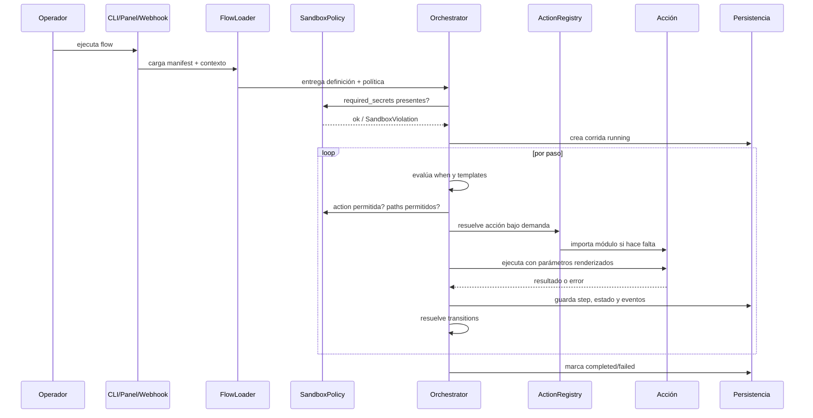

# 📐 Arquitectura

> Diseño técnico, capas y flujo de ejecución del orquestador.

Automa está organizado como un motor local de automatización declarativa. Su unidad mínima es un flow: una carpeta dentro de `flows/` con `manifest.json`, contexto de ejemplo y documentación corta. El motor aplica una política de sandbox por flow y persiste cada corrida en SQLite + snapshots JSON + eventos JSONL.

---

## 🧱 Capas

| Capa | Carpeta | Responsabilidad |
| --- | --- | --- |
| 🖥️ Panel local + API | `app/` | UI 3-tabs, endpoints JSON, métricas y webhook autenticado |
| ⚙️ Motor | `engine/` | carga manifests, valida schema, aplica sandbox, ejecuta pasos, scheduler con cron, métricas |
| 📦 Acciones | `actions/` | funciones concretas: filesystem, sistema, pantalla, UI, HTTP, reglas, visión, notificación |
| 🧩 Plugins | `plugins/` | analizadores extensibles para imágenes y OCR |
| 📋 Casos | `flows/` | procesos ejecutables declarados como JSON |
| 🧪 Schema | `schemas/` | contrato JSON Schema del manifest |
| ✅ Tests | `tests/` | suite pytest unitaria + integración |
| 💾 Estado | `db/`, `state/`, `logs/`, `output/`, `secrets/` | historial, snapshots, eventos, salidas y bóveda local |

---

## 🔄 Flujo De Ejecución

---

## 🔩 Componentes Clave

- [engine/loader.py](../engine/loader.py): lee `manifest.json` y contexto operativo.
- [engine/manifest_schema.py](../engine/manifest_schema.py): validación contra `schemas/manifest.schema.json` con fallback estructural si `jsonschema` no está disponible.
- [engine/sandbox.py](../engine/sandbox.py): `SandboxPolicy` con `allowed_actions`, `required_secrets`, `allowed_paths` y `max_runtime_seconds`.
- [engine/orchestrator.py](../engine/orchestrator.py): gobierna la corrida completa.
- [engine/action_registry.py](../engine/action_registry.py): resuelve acciones de forma perezosa. Descubre extensiones de terceros vía entry-points `automa.actions`.
- [engine/template.py](../engine/template.py): reemplaza placeholders.
- [engine/conditions.py](../engine/conditions.py): evalúa `when` y condiciones de transición.
- [engine/database.py](../engine/database.py): persiste catálogo, runs, steps, events, configs, schedules y `run_locks`.
- [engine/scheduler.py](../engine/scheduler.py): bucle que dispara flows; usa lock SQLite para concurrencia.
- [engine/cron.py](../engine/cron.py): parser cron de 5 campos sin dependencia externa.
- [engine/metrics.py](../engine/metrics.py): agregaciones para panel, JSON y exposición Prometheus.
- [engine/secrets.py](../engine/secrets.py): bóveda env > file.
- [app/server.py](../app/server.py): panel + API JSON + `/metrics` + webhook `/api/hook/<folder>`.

---

## 💾 Persistencia

| Recurso | Uso |
| --- | --- |
| `db/runs.db` | flows, runs, steps, events, configs, schedules, run_locks |
| `state/*.json` | snapshot completo por corrida |
| `logs/*.jsonl` | eventos técnicos ordenados temporalmente |
| `output/reports/*.json` | reportes generados por flows |
| `output/screenshots/*.png` | capturas de pantalla cuando aplica |
| `secrets/secrets.json` | bóveda local (ignorada por git) |

---

## 📜 Contrato De Un Paso

Un paso declara:

- `id`: identificador único dentro del flow.
- `action`: nombre registrado (built-in o por entry-points).
- `params`: argumentos para la acción.
- `save_as`: clave donde se guarda el resultado en contexto.
- `when`: condición opcional para saltar o ejecutar.
- `retries`: reintentos ante error.
- `transitions`: rutas explícitas hacia otros pasos o fin.

---

## 🛡️ Política De Sandbox

Campos opcionales del manifest aplicados por el motor antes y durante la corrida:

| Campo | Efecto |
| --- | --- |
| `allowed_actions` | sólo estas acciones pueden invocarse en el flow |
| `required_secrets` | se exigen antes de iniciar; se buscan en `os.environ` y `secrets/secrets.json` |
| `allowed_paths` | toda ruta en `params` debe estar bajo uno de estos prefijos |
| `max_runtime_seconds` | si se supera, el siguiente paso aborta con `FlowExecutionError` |

Las violaciones se registran como evento `step_blocked`/`flow_blocked` y la corrida queda en `failed` con `error.kind = "sandbox_violation"`.

---

## 🔀 Branching

El motor resuelve transiciones en orden. Si una transición coincide por evento (`success`, `failure` o `any`) y su condición `when` es verdadera, se toma esa ruta. Si ninguna aplica, avanza al siguiente paso declarado.

---

## ⏰ Scheduler

Lee la tabla `schedules`, compara `next_run_at` con la hora UTC actual y dispara corridas en threads daemon. Soporta dos modos:

- `interval_seconds`: ejecución cada N segundos.
- `cron_expression`: 5 campos (`min hora dom mes dow`) — listas, rangos y pasos.

La concurrencia se controla en `run_locks` (insert único por folder). Si una corrida está activa, el scheduler omite el folder en ese tick.

---

## 📊 Métricas Y API

El panel expone:

- `/healthz` — readiness simple.
- `/api/flows`, `/api/runs?flow_id=&limit=` — catálogo y corridas en JSON.
- `/api/metrics` — agregaciones (totales, ventana móvil, top acciones lentas/fallidas/con retries).
- `/metrics` — formato Prometheus text.
- `/metrics/dashboard` — vista HTML de las métricas.
- `POST /api/hook/<folder>` — disparador externo autenticado por header `X-Automa-Token`.

---

## 📦 Empaquetado Y CI

- `pyproject.toml` declara dependencias, extras (`dev`, `schema`) y entry-points para CLI (`automa`, `automa-panel`, `automa-validate`) y para acciones built-in (`automa.actions`).
- CI en GitHub Actions usa `uv` en matriz Linux/Windows × Python 3.10/3.11/3.12: lint con ruff, validación de manifests, pytest con cobertura, smoke job.

---

## 🏠 Diseño Local-First

- Panel en `127.0.0.1`.
- Base SQLite local.
- OCR local opcional.
- Proveedor visual `mock` para pruebas sin IA externa.
- Integración con Ollama o endpoints compatibles cuando el operador lo decide.
- Webhook deshabilitado por defecto (requiere `AUTOMA_WEBHOOK_TOKEN`).

---

## 🚧 Límites Arquitectónicos Actuales

> [!IMPORTANT]
> Estos límites son deliberados para mantener simplicidad. Si tu caso los vuelve críticos, fork el repo y agrega lo que necesites; el motor está diseñado para ser extensible.

- Sandbox aplica a nivel orquestador, no a nivel OS — un proceso lanzado por una acción permitida puede saltarse `allowed_paths`.
- No hay multiusuario ni RBAC en el panel.
- El scheduler es local y simple; no coordina múltiples máquinas.
- La persistencia está optimizada para trazabilidad local, no para alta concurrencia.
- La UI del panel es server-rendered y deliberadamente liviana.
