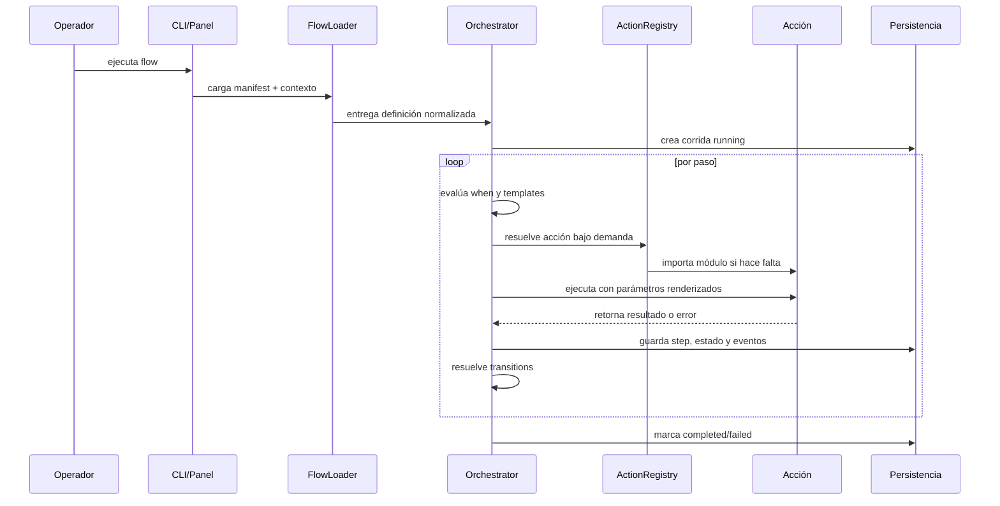

# Arquitectura

Flujo Autónomo está organizado como un motor local de automatización declarativa. Su unidad mínima es un flow: una carpeta dentro de `flows/` con `manifest.json`, contexto de ejemplo y documentación corta.

## Capas

| Capa | Carpeta | Responsabilidad |
| --- | --- | --- |
| Panel local | `app/` | UI HTML para ejecutar flows, editar configuración, ver historial y scheduler |
| Motor | `engine/` | carga manifests, resuelve templates, ejecuta pasos, aplica branching y persiste corridas |
| Acciones | `actions/` | funciones concretas que operan filesystem, sistema, pantalla, UI, HTTP y reglas |
| Plugins | `plugins/` | analizadores extensibles, especialmente para imágenes y OCR |
| Casos | `flows/` | procesos ejecutables declarados como JSON |
| Estado | `db/`, `state/`, `logs/`, `output/` | historial, snapshots, eventos y salidas físicas |

## Flujo De Ejecución

## Componentes Clave

- `engine/loader.py`: lee `manifest.json` y contexto operativo.
- `engine/orchestrator.py`: gobierna la corrida completa.
- `engine/action_registry.py`: resuelve acciones de forma perezosa para evitar dependencias innecesarias.
- `engine/template.py`: reemplaza placeholders como `{{ capture.image_path }}` o `{now}`.
- `engine/conditions.py`: evalúa `when` y condiciones de transición.
- `engine/database.py`: persiste catálogo, corridas, pasos, eventos, configs y schedules.
- `engine/scheduler.py`: dispara flows programados según `next_run_at`.
- `app/server.py`: panel local sobre `ThreadingHTTPServer`.

## Persistencia

| Recurso | Uso |
| --- | --- |
| `db/runs.db` | consulta rápida de flows, runs, steps, events, configs y schedules |
| `state/*.json` | snapshot completo por corrida |
| `logs/*.jsonl` | eventos técnicos ordenados temporalmente |
| `output/reports/*.json` | reportes generados por flows |
| `output/screenshots/*.png` | capturas de pantalla cuando aplica |

Los archivos generados se ignoran en Git, salvo `.gitkeep`, para mantener el repositorio limpio.

## Contrato De Un Paso

Un paso declara:

- `id`: identificador único dentro del flow.
- `action`: nombre registrado en `ACTION_REGISTRY`.
- `params`: argumentos para la acción.
- `save_as`: clave donde se guarda el resultado en contexto.
- `when`: condición opcional para saltar o ejecutar.
- `retries`: reintentos ante error.
- `transitions`: rutas explícitas hacia otros pasos o fin.

## Branching

El motor resuelve transiciones en orden. Si una transición coincide por evento (`success`, `failure` o `any`) y su condición `when` es verdadera, se toma esa ruta. Si ninguna aplica, avanza al siguiente paso declarado.

## Scheduler

El scheduler lee la tabla `schedules`, compara `next_run_at` con la hora UTC actual y dispara corridas en threads daemon. Mantiene una marca por flow para evitar ejecuciones paralelas del mismo folder.

## Diseño Local-First

El producto está pensado para correr en un PC del operador:

- panel en `127.0.0.1`;
- base SQLite local;
- OCR local opcional;
- proveedor visual `mock` para pruebas sin IA externa;
- integración con Ollama o endpoints compatibles cuando el operador lo decide.

## Límites Arquitectónicos Actuales

- No hay aislamiento fuerte por acción: los manifests confiables son parte del modelo operativo.
- No hay multiusuario ni RBAC.
- El scheduler es local y simple; no coordina múltiples máquinas.
- La persistencia está optimizada para trazabilidad local, no para alta concurrencia.
- La UI del panel es server-rendered y deliberadamente liviana.
