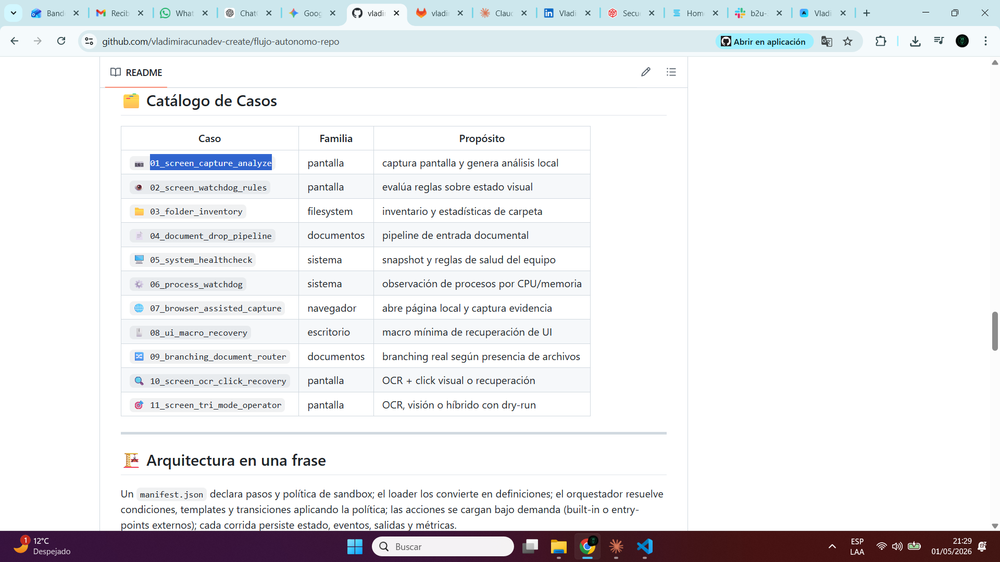
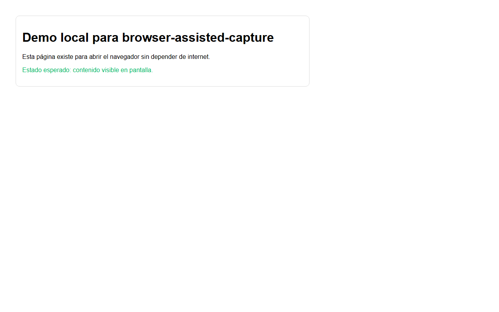

# 📘 Manual de Usuario · Flujo Autónomo

> Manual operativo con **2 casos de captura claramente diferenciados**: caso 1 captura el escritorio, caso 12 captura el navegador. Ambos generan PNG reales (no JSON).


> [!IMPORTANT]
> Esta versión limpia el sistema (0 corridas en histórico, 0 schedules) y agrega el caso 12 con **Playwright** para distinguir captura de escritorio vs captura de navegador.

---

## 🎯 La diferencia clave: 01 vs 12

| | **Caso 01 — escritorio** | **Caso 12 — navegador** |
| --- | --- | --- |
| Tecnología | `mss` + `Pillow` | `playwright` + Chromium headless |
| Lo que captura | toda la pantalla del PC | solo el DOM renderizado de una URL |
| Tamaño típico | 1920×1080 (resolución del monitor) | viewport configurable + página completa |
| Headless | ❌ requiere sesión gráfica | ✅ funciona sin display |
| Velocidad | ~0.3 s | ~6 s (lanza Chromium) |
| Open source upstream | [BoboTiG/python-mss](https://github.com/BoboTiG/python-mss) | [microsoft/playwright-python](https://github.com/microsoft/playwright-python) |

### Caso 01 — captura del escritorio (1920×1080)



> Esto es **toda la pantalla del PC**: incluye Chrome con cualquier página, la barra de tareas de Windows, los iconos del escritorio, etc. Lo que ves arriba es lo que tenía mi pantalla cuando ejecuté el flow 01.

### Caso 02 — captura del navegador headless



> Esto es **solo el contenido HTML renderizado** de `data/web/control_page.html`: el `<h1>`, los párrafos, el border. **Sin barra de Windows, sin escritorio, sin Chrome visible**. Se renderizó dentro de Chromium headless de Playwright y se capturó solo el DOM.

> 📌 **La forma más directa de ver la diferencia**: las dos imágenes existen, son las mismas dimensiones distintas, una contiene Windows y la otra solo HTML.

---

## ⚡ Setup

```bash
# Con uv
uv sync --extra dev --extra schema

# Para el caso 12 además:
pip install playwright
python -m playwright install chromium
```

Levantar el panel:

```bash
python -m app.server
```

---

## 🗂️ Catálogo de los 12 casos

| # | Caso | Familia | Genera | Requisitos |
| --- | --- | --- | --- | --- |
| 01 | Captura y análisis local de pantalla | pantalla | 🖼️ PNG escritorio + JSON | mss/Pillow |
| 02 | Watchdog visual por reglas | pantalla | 🖼️ PNG + JSON | mss/Pillow |
| 03 | Inventario de carpeta | filesystem | 📊 JSON | stdlib |
| 04 | Pipeline documental | documentos | 📊 JSON | stdlib |
| 05 | Healthcheck del sistema | sistema | 📊 JSON | psutil |
| 06 | Watchdog de procesos | sistema | 📊 JSON | psutil |
| 07 | Captura asistida por navegador | navegador | 🖼️ PNG escritorio + JSON | navegador real |
| 08 | Macro de recuperación de UI | escritorio | 🖼️ PNG + JSON | pyautogui |
| 09 | Router documental con branching | documentos | 📊 JSON | stdlib |
| 10 | OCR visual + click o recuperación | pantalla | 🖼️ PNG + JSON | Tesseract + pyautogui |
| 11 | Operador visual tri-modo | pantalla | 📊 JSON | configurable |
| **12** | **Captura del navegador (headless)** | **navegador** | **🖼️ PNG navegador** | **playwright + chromium** |

---

## 🧹 Estado del sistema tras esta sesión

```bash
# Después de la limpieza
$ ls db/                          # 0 archivos (sin runs.db)
$ ls logs/                        # 0 archivos
$ ls state/                       # 0 archivos
$ ls output/screenshots/          # 0 archivos (antes de las pruebas)
$ ls output/reports/              # 0 archivos

# Schedules activos: 0
$ python -c "from engine.database import init_db, list_schedules; init_db(); print(list_schedules())"
[]
```

> [!IMPORTANT]
> El historial se limpia con: `rm -f db/runs.db && rm -rf logs/* state/* output/screenshots/* output/reports/*`. La DB se recrea vacía al primer arranque.

---

## ✅ Verificación final tras los cambios

| Item | Resultado |
| --- | --- |
| Tests pytest | ✅ 84/84 |
| Validador manifests | ✅ 12 flows, 28 acciones, 0 errores |
| Lint ruff | ✅ All checks passed |
| Caso 1 genera PNG real del escritorio | ✅ 1920×1080 |
| Caso 12 genera PNG real del navegador | ✅ 1280×800 (DOM puro) |
| Schedules activos | 0 |
| Runs en DB | 0 |
| Logs/state previos | 0 |

---

## 🔓 Repos open-source de captura usados

- [BoboTiG/python-mss](https://github.com/BoboTiG/python-mss) — captura multi-monitor sin dependencias del sistema (caso 01)
- [python-pillow/Pillow](https://github.com/python-pillow/Pillow) — fallback de captura via `ImageGrab` (caso 01)
- [microsoft/playwright-python](https://github.com/microsoft/playwright-python) — captura headless del DOM (caso 12)

---

## ⚡ Ejecutar los dos casos de captura

```bash
# Caso 1: captura el escritorio Windows entero
flujo run flows/01_screen_capture_analyze
# → output/screenshots/screen_<ts>.png  (1920×1080, todo el escritorio)

# Caso 02: captura solo el navegador con Playwright headless
flujo run flows/02_screen_capture_browser
# → output/screenshots/browser_page_<ts>.png  (1280×800, solo el DOM renderizado)
```

O desde el panel: tab `▶ Ejecutar` → click en cualquiera de las dos cards.
