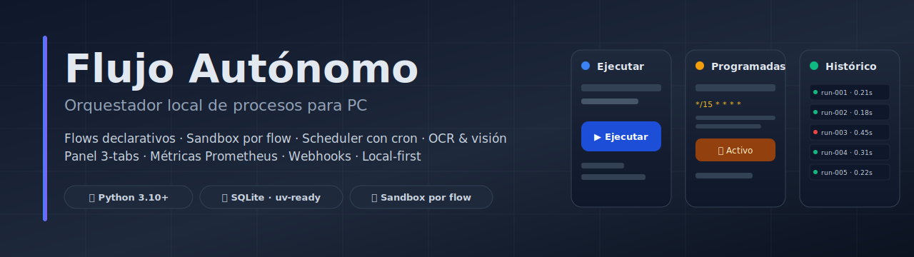

# 📖 Operación

> Cómo usar Flujo Autónomo en un entorno local sin asumir infraestructura externa.



## 📑 Tabla de contenidos

- [⚡ Preparación](#-preparación)
- [🖥️ Panel Local](#️-panel-local)
- [⌨️ CLI](#️-cli)
- [⚙️ Contexto operativo](#️-contexto-operativo)
- [🔐 Secretos](#-secretos)
- [⏰ Scheduler con cron](#-scheduler-con-cron)
- [🔒 Concurrencia](#-concurrencia)
- [📂 Salidas](#-salidas)
- [🌐 Endpoints HTTP](#-endpoints-http)
- [🎯 Flujo recomendado de operación](#-flujo-recomendado-de-operación)
- [✅ Criterios para scheduler](#-criterios-para-scheduler)

---

## ⚡ Preparación

### Con uv (recomendado)

```bash
uv sync --extra dev --extra schema
```

`uv` resuelve dependencias mucho más rápido que `pip` y maneja el entorno virtual por ti.

### Con pip

```bash
python -m venv .venv
source .venv/bin/activate     # Windows: .venv\Scripts\activate
pip install -e ".[dev,schema]"
```

## 🖥️ Panel Local

El panel está organizado en 3 tabs:

| Tab | Para qué |
| --- | --- |
| **▶ Ejecutar** | Click-to-run en tiempo real por flow, status live, link a detalle |
| **⏰ Programadas** | Activar/configurar scheduler con intervalo o cron, ver next/last run |
| **📜 Histórico** | Tabla buscable de todas las corridas, badge de estado, duración |

Para arrancarlo:


```bash
uv run python -m app.server          # con uv
python -m app.server                 # con pip
flujo-panel                          # tras instalar el paquete
```

Abre:

```text
http://127.0.0.1:8787
```

Desde el panel puedes:

- 👀 ver todos los flows;
- ▶ ejecutar un flow manualmente con un clic;
- ✏️ editar el contexto operativo guardado en `configs/`;
- ⏰ activar/desactivar scheduler por flow (intervalo o cron);
- 📜 revisar historial y detalle de corridas;
- 🖼️ abrir archivos generados dentro del workspace (capturas con thumbnail inline);
- 📊 consultar el dashboard de métricas en `/metrics/dashboard`.

---

## ⌨️ CLI

Tras instalar el paquete editable, los entry-points son:

```bash
flujo list
flujo run flows/05_system_healthcheck
flujo run flows/03_folder_inventory --context configs/03_folder_inventory.json
flujo scheduler --interval 2
flujo-validate
```

Sin instalar el paquete:

```bash
python -m engine.runner list
python -m engine.runner run flows/05_system_healthcheck
python -m engine.runner scheduler --interval 2
python scripts/validate_project.py
```

---

## ⚙️ Contexto operativo

El contexto se carga en este orden:

1. archivo pasado por `--context`;
2. `configs/<folder>.json`;
3. `flows/<folder>/context.user.json`;
4. `flows/<folder>/context.example.json`;
5. `{}` si no existe nada.

Recomendaciones:

- usa `context.example.json` como contrato documentado;
- usa `configs/` para operación local;
- **nunca** guardes secretos ahí — usa la bóveda local (ver abajo).

---

## 🔐 Secretos

Dos fuentes, prioridad env > file:

1. **Variables de entorno** — recomendable en producción local (servicio, systemd, scheduled task de Windows).
2. **`secrets/secrets.json`** — útil para desarrollo. La carpeta `secrets/` está en `.gitignore`.

Se gestionan vía [engine/secrets.py](../engine/secrets.py):

```python
from engine.secrets import get_secret, set_secret
set_secret("MY_API_KEY", "sk-...")
get_secret("MY_API_KEY")
```

Los flows pueden exigirlos con `required_secrets` (sandbox) y las acciones (p. ej. `notify.send`) pueden referenciarlos con `@secret:NOMBRE`.

---

## ⏰ Scheduler con cron

Desde el panel, en la página de configuración del flow, ahora se puede definir una expresión cron de 5 campos:

```text
min  hora  dom  mes  dow

*/15  *    *   *    *      cada 15 min
0     6    *   *    *      diariamente a las 06:00 UTC
0     9    *   *    1-5    lunes a viernes 09:00 UTC
0     0    1   *    *      primer día del mes 00:00
```

Soporta listas (`1,3,5`), rangos (`9-17`) y pasos (`*/5`). No soporta nombres simbólicos (`MON`, `JAN`) ni `L`/`W`/`#`.

Si dejas la expresión vacía, se usa el `interval_seconds` clásico.

---

## 🔒 Concurrencia

El scheduler no lanzará dos corridas paralelas del mismo flow. Esto se hace con `run_locks` en SQLite (sobrevive a reinicios). Si hace falta forzar la liberación tras una caída, usa:

```python
from engine.database import force_release_lock
force_release_lock("05_system_healthcheck")
```

---

## 📂 Salidas

| Carpeta | Contenido |
| --- | --- |
| 💾 `db/runs.db` | historial consultable |
| 📂 `state/*.json` | estado completo de cada corrida |
| 📜 `logs/*.jsonl` | eventos técnicos |
| 📊 `output/reports/*.json` | reportes físicos |
| 🖼️ `output/screenshots/*.png` | capturas |

---

## 🌐 Endpoints HTTP

| Endpoint | Uso |
| --- | --- |
| 🏠 `GET /` | panel 3-tabs (Ejecutar · Programadas · Histórico) |
| 📋 `GET /flow/<folder>` | info del flow |
| ⚙️ `GET /flow/<folder>/config` | editor de contexto y scheduler |
| 📜 `GET /flow/<folder>/history` | histórico por flow |
| 🔍 `GET /run/<flow_id>/<run_id>` | detalle de corrida con thumbnails |
| 📊 `GET /metrics/dashboard` | dashboard HTML con KPI cards |
| 🌐 `GET /api/flows`, `GET /api/runs`, `GET /api/metrics` | JSON |
| 📈 `GET /metrics` | Prometheus text |
| ✅ `GET /healthz` | check simple |
| ⚡ `POST /api/run/<folder>` | click-to-run desde el panel |
| 🪝 `POST /api/hook/<folder>` | disparador externo (header `X-Flujo-Token`) |

Detalle del webhook en [INTEGRACIONES.md](INTEGRACIONES.md). Detalle de métricas en [METRICAS.md](METRICAS.md).

---

## 🎯 Flujo recomendado de operación

1. Ejecuta `python scripts/validate_project.py`.
2. Ejecuta `pytest -q` si tocaste motor, acciones o schema.
3. Lista flows con `flujo list`.
4. Revisa/ajusta `configs/<flow>.json`.
5. Ejecuta primero con `dry_run` si hay UI o clicks.
6. Revisa detalle de corrida en panel.
7. Activa scheduler solo cuando el flow ya corrió bien manualmente.
8. Si lo expones a integraciones externas, configura `FLUJO_WEBHOOK_TOKEN`.

---

## ✅ Criterios para scheduler

Activa scheduler cuando:

- el flow es idempotente o tolera repetición;
- sus salidas no pisan archivos críticos;
- no requiere supervisión humana inmediata;
- no ejecuta clicks reales sin haber sido probado.

Evita scheduler cuando:

- el flow modifica archivos de alto valor;
- usa `ui.launch_process` con comandos dinámicos;
- depende de una ventana exacta no controlada;
- se está ajustando `fallback_bbox` o coordenadas.
