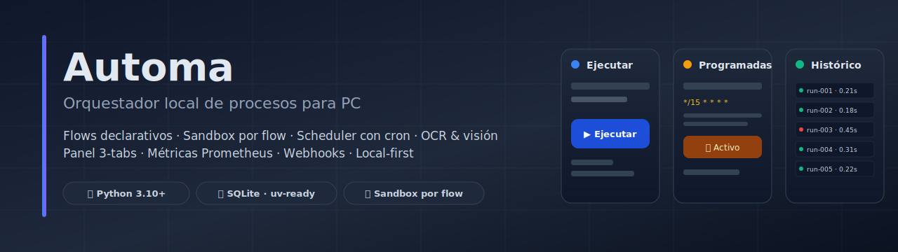

# 🛣️ Roadmap de casos · Automa

> Este documento describe **qué casos vienen** para el catálogo `flows/`.
> El sistema **se construye agregando casos**, no refactorizando el motor.
> El sustrato (`engine/`, sandbox, scheduler, DB, schemas) está operativo
> y solo se toca si un caso necesita una primitiva que no existe.



---

## 🎯 Criterio de evolución

El [README §Filtro de aceptación](../README.md#-para-qué-existe-este-repositorio) marca dos niveles:

- 🟢 **Avanzados** — abren ventanas reales, interactúan con DOM, capturan evidencia contextualizada. **Son los que justifican el producto.**
- 🟡 **Utilidades base** — solo emiten JSON. Mínimo aceptable, no son foco.

Toda inversión nueva va a 🟢. La dirección: **operar componentes nativos de Windows con un clic**.

---

## ✅ Catálogo actual · 7 flows

Detalle completo en [README §Catálogo actual](../README.md#-catálogo-actual--7-flows-operativos) y [docs/FAMILIAS_Y_CASOS.md](FAMILIAS_Y_CASOS.md).

| # | Slug | Nivel |
| --- | --- | --- |
| 01 | `screen_capture_analyze` | 🟢 |
| 02 | `screen_capture_browser` | 🟢 |
| 03 | `folder_inventory` | 🟡 |
| 04 | `document_drop_pipeline` | 🟡 |
| 05 | `system_healthcheck` | 🟡 |
| 06 | `process_watchdog` | 🟡 |
| 07 | `browser_form_filler` | 🟢 |

---

## 🚀 Fase 1 · Componentes nativos de Windows (con acciones ya existentes)

**Cinco casos nuevos que no requieren código nuevo en el motor ni nuevas acciones.** Todos usan primitivas ya registradas: `ui.hotkey`, `ui.launch_process`, `ui.type_text`, `ui.open_url`, `screen.capture_screenshot`, `vision.ocr_image`, `filesystem.write_json`.

| # | Slug | Componente Windows | Qué hace en un clic | Atajo |
| --- | --- | --- | --- | --- |
| 08 | `windows_lock_workstation` | Sesión del usuario | Bloquea el equipo (`Win+L`). | `Alt+8` |
| 09 | `show_desktop_capture` | Shell de Windows | Minimiza todas las ventanas (`Win+D`), espera 800 ms, captura el escritorio limpio en PNG. | `Alt+9` |
| 10 | `explorer_open_path` | File Explorer | Abre `explorer.exe` en una ruta configurable (por defecto `C:\Users`). | `Alt+0` |
| 11 | `settings_open_section` | Settings app (UWP) | Abre la app **Configuración** en la sección configurable vía URI `ms-settings:` (red, pantalla, sonido, …). | `Alt+-` |
| 12 | `desktop_ocr_inventory` | Escritorio + visión | Captura el escritorio completo, ejecuta OCR sobre la imagen y guarda **todos los textos visibles** (con bboxes) como inventario JSON. | `Alt+=` |

Tras Fase 1 el catálogo queda en **12 flows · todos los atajos Alt ocupados**.

### Estado: 🟢 lanzado en esta versión

---

## 🟡 Fase 2 · Componentes Windows que necesitan acciones nuevas mínimas

Cada caso aquí requiere **una acción nueva en `actions/`** (~10–30 LOC). Estrictamente aditivo — ningún cambio rompe nada existente. Las acciones nuevas se registran como entry-point `automa.actions` en `pyproject.toml` igual que las built-in actuales (ver [docs/EXTENSION.md](EXTENSION.md)).

| # | Slug | Componente Windows | Acción nueva requerida | Tamaño estimado |
| --- | --- | --- | --- | --- |
| 13 | `notepad_quick_note` | Notepad | — (usa `ui.launch_process` + `ui.type_text` existentes) | 0 LOC nuevos |
| 14 | `run_dialog_command` | Diálogo Ejecutar (`Win+R`) | — (solo `ui.hotkey` + `ui.type_text`) | 0 LOC nuevos |
| 15 | `clipboard_capture` | Portapapeles de Windows | `system.read_clipboard` (vía `win32clipboard` o `pyperclip`) | ~15 LOC |
| 16 | `active_window_screenshot` | Win32 ventana activa | `screen.capture_active_window` (vía `pygetwindow` + `mss`) | ~25 LOC |
| 17 | `taskmgr_snapshot` | Task Manager | — (solo `ui.hotkey` + `screen.capture_screenshot` + `vision.ocr_image`) | 0 LOC nuevos |
| 18 | `powershell_audit` | PowerShell | `system.run_powershell` con allowlist de comandos | ~30 LOC |
| 19 | `taskbar_capture` | Barra de tareas | `screen.capture_region(bbox)` para captura parcial | ~15 LOC |
| 20 | `volume_mute_toggle` | Audio del sistema | — (solo `ui.hotkey` con tecla multimedia `volumemute`) | 0 LOC nuevos |

### Estado: 📋 propuesto, no implementado

> [!NOTE]
> **Capacidad de atajos**: el panel mapea `Alt+1..Alt+=` (12 flows). A partir del flow 13 los nuevos casos siguen accesibles por click en su card del panel, pero **sin atajo Alt**. Cuando sumemos varios más sin atajo, evaluamos extender el mecanismo (`Alt+Shift+N`, paginar atajos por familia, …).

---

## 🔭 Fase 3 · Apps Windows nativas

Operar aplicaciones reales del sistema, usando la combinación `ui.launch_process` + sincronización OCR + automatización por teclado. Estos casos son los que el [README §Próximos pasos](../README.md#-próximos-pasos) menciona literalmente.

| Caso candidato | Componente | Notas |
| --- | --- | --- |
| `excel_open_seed` | Microsoft Excel | Abre `.xlsx` seed, requiere Office instalado. |
| `word_open_template` | Microsoft Word | Abre `.docx` template, requiere Office instalado. |
| `pdf_reader_open` | PDF reader por defecto | Vía `ui.open_file_in_browser` o `start <path.pdf>`. |
| `outlook_compose_draft` | Microsoft Outlook | Abre nueva composición pre-rellenada vía URI `mailto:`. |
| `edge_open_profile` | Microsoft Edge | Lanza Edge con perfil específico. |

### Estado: 🔭 ideación, sin manifest

> Para implementar Fase 3 se necesita primero:
>
> 1. Decidir qué subset de apps Office están en el equipo objetivo.
> 2. Probablemente una acción `system.wait_for_window(title_pattern, timeout)` para sincronizar de forma determinista la espera de que la app cargue antes de actuar. ~20 LOC, usa `pygetwindow`.
> 3. Una librería de **templates de imagen** en `data/assets/<app>/` (capturas de botones nativos) para anclaje visual sin coordenadas frágiles.

---

## 📐 Patrón para agregar un caso nuevo

Resumen rápido — detalle completo en [docs/CREAR_FLUJOS.md](CREAR_FLUJOS.md):

```text
flows/NN_<slug>/
  manifest.json              # id, name, family, description, sandbox, steps
  context.example.json       # valores por defecto del contexto
  README.md                  # propósito, contexto esperado, salida, riesgos
```

1. Declarar **sandbox por flow** (`allowed_actions`, `allowed_paths`, `max_runtime_seconds`).
2. Si la acción que el caso necesita no existe en `actions/`, agregarla en su propio módulo y registrarla en `pyproject.toml` `[project.entry-points."automa.actions"]`. **Nunca** modificar acciones existentes.
3. Si el caso necesita input por atajo, ajustar `inline_input_html` en [app/server.py](../app/server.py) (excepción: cambio mínimo y solo si es realmente necesario).
4. Correr `uv run python scripts/validate_project.py` antes de commitear.

---

## 🚫 Lo que NO está en el roadmap

Para mantener foco:

- **No** integración con LLM / servicios IA externos. El sistema es local y determinista. El "razonamiento" lo da el manifest declarativo + `engine/conditions.py`.
- **No** refactor del motor sin un caso que lo exija. El sustrato actual está 🟢 operativo según [README §Estado del producto](../README.md#-estado-del-producto--v040).
- **No** RBAC / multiusuario. Es una herramienta para **un operador local** en su equipo Windows.
- **No** dependencias en la nube. Webhooks IN/OUT existen pero son opt-in y locales.

---

## 📝 Cómo proponer un caso nuevo

Abre un issue en GitHub con la plantilla:

- **Componente Windows objetivo**: ¿qué app/parte de Windows opera?
- **Qué hace en un clic**: descripción operativa de 1-2 líneas.
- **Acciones que usa**: cuáles existen, cuáles habría que crear.
- **Riesgos**: ¿modifica filesystem? ¿abre ventanas con foco? ¿requiere permisos elevados?
- **Salida esperada**: PNG, JSON, ambos.

---

Última actualización: 2026-06-02 · Fase 1 lanzada.
