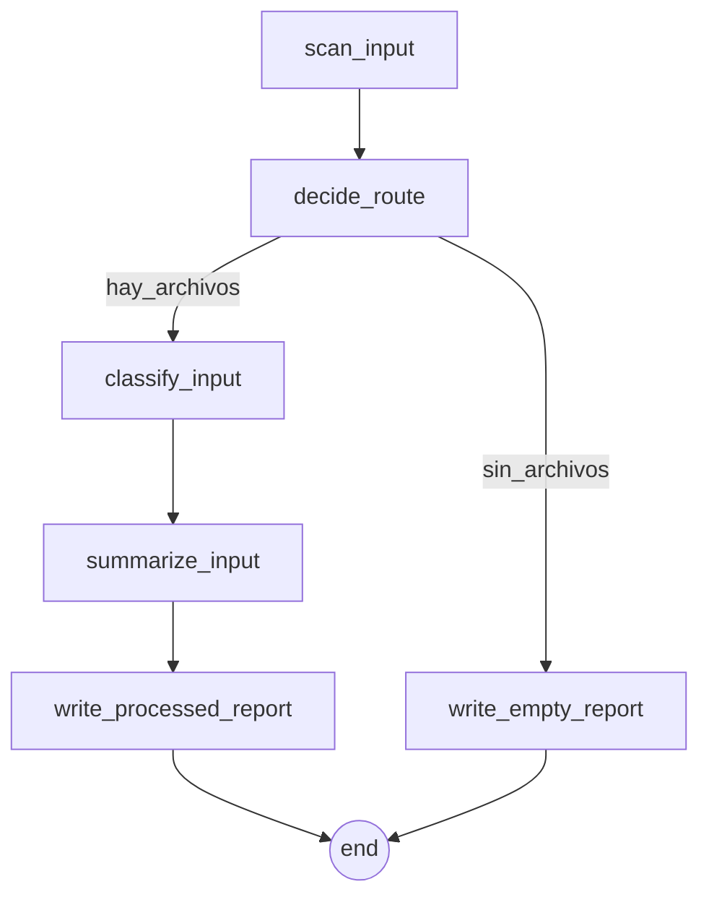

# 🔀 09 · Router documental con branching

> Si hay archivos en la entrada, los procesa; si no, escribe un reporte vacío distinto.

| | |
| --- | --- |
| **Familia** | documentos |
| **Plataforma** | 🟢 Windows · 🟢 Linux · 🟢 macOS · 🟢 headless |
| **Internet** | ❌ no requerido |
| **Modifica el sistema** | ❌ solo lee y escribe en `output/` |

---

## 🎯 Para qué sirve

- 🧪 **Demostración canónica de `transitions` con `when`** — caso de referencia para aprender branching.
- 📋 Pipeline real: escanea entrada, decide ruta y produce reporte distinto.
- 🛡️ Útil cuando el scheduler corre algo que a veces no tiene trabajo.

## 🧭 Flujo paso a paso



| # | Paso | Acción | Qué hace |
| --- | --- | --- | --- |
| 1 | `scan_input` | `filesystem.list_directory` | Lista no-recursiva. |
| 2 | `decide_route` | `rules.evaluate` | `total_files > 0` → `hay_archivos`, sino `sin_archivos`. |
| 3a | `classify_input` (rama hay_archivos) | `filesystem.classify_file_inventory` | Stats. |
| 4a | `summarize_input` | `filesystem.summarize_text_folder` | Previews. |
| 5a | `write_processed_report` | `filesystem.write_json` | Reporte completo. Termina. |
| 3b | `write_empty_report` (rama vacía) | `filesystem.write_json` | Reporte vacío. Termina. |

## ⚙️ Configuración

```json
{ "source_path": "data/dropbox/inbox" }
```

## 📋 Requisitos

- ✅ Solo Python stdlib.
- ✅ Permisos de lectura sobre `source_path`.

## 🛡️ Sandbox sugerido

```json
{
  "allowed_actions": [
    "filesystem.list_directory", "filesystem.classify_file_inventory",
    "filesystem.summarize_text_folder", "filesystem.write_json", "rules.evaluate"
  ],
  "allowed_paths": ["data/dropbox", "output/reports"]
}
```

## ⚠️ Limitaciones

- ❌ Solo bifurca en `total_files > 0`. Para condiciones más finas, edita las reglas.
- ❌ No mueve archivos procesados — la próxima corrida los volverá a procesar si no rotas.

## 🎮 Control que tienes

| Aspecto | Cómo se cambia |
| --- | --- |
| Carpeta de entrada | `source_path` en config |
| Condición de bifurcación | Regla en `decide_route` |
| Rama "con archivos" | Pasos 3a/4a/5a |
| Rama "sin archivos" | Paso 3b — agregar p.ej. `notify.send` |

## 📤 Salidas

Dos archivos posibles, mutuamente excluyentes:

- 📊 `output/reports/branching_processed_<ts>.json` — hubo archivos
- 📊 `output/reports/branching_empty_<ts>.json` — no hubo archivos

Ambos incluyen `decision`. El `state` de la corrida tiene `route: [...]` con los step_ids realmente ejecutados.

## ⚡ Ejecución

```bash
flujo run flows/09_branching_document_router
# Verificar la rama tomada en panel: tab Histórico → click run → 'route' en contexto
```
