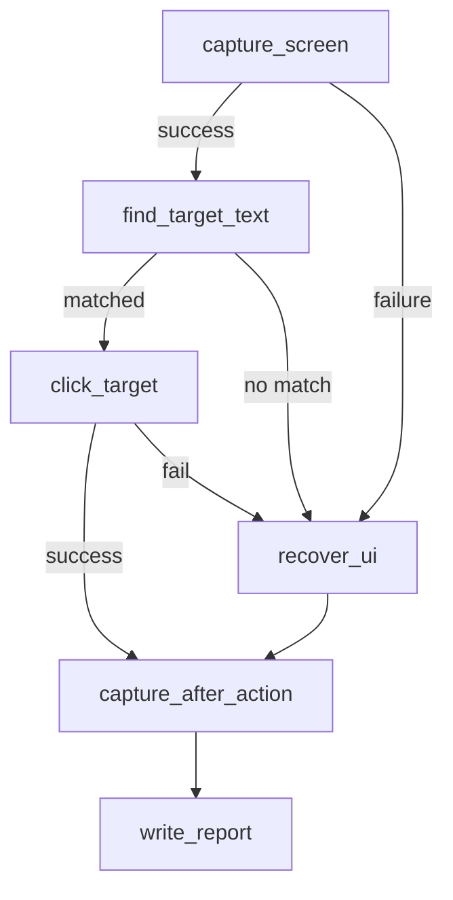

# 🔍 10 · OCR + click visual o recuperación

> Captura, busca un texto por OCR, hace click en su bounding box. Si falla, ejecuta hotkey de recuperación.

| | |
| --- | --- |
| **Familia** | pantalla / escritorio |
| **Plataforma** | 🟢 Windows · 🟢 Linux · 🟢 macOS (con sesión gráfica + Tesseract) |
| **Internet** | ❌ no requerido |
| **Modifica el sistema** | ⚠️⚠️ hace clicks reales y envía hotkeys |

---

> [!WARNING]
> Hace **clicks reales** según OCR. Antes de cada uso valida con `flow 11` en modo `ui_dry_run: true`.

## 🎯 Para qué sirve

- 🤖 Click sobre un botón visible cuya posición no es estable.
- 🆘 Fallback automático: si no encuentra el texto, ejecuta hotkey de recuperación.
- 🧪 Probar OCR + acción coordinada antes del flow 11.

## 🧭 Flujo paso a paso



| # | Paso | Acción | Qué hace |
| --- | --- | --- | --- |
| 1 | `capture_screen` | `screen.capture_screenshot` | Captura PNG. Si falla → recover_ui. |
| 2 | `find_target_text` | `vision.find_text_in_image` | OCR (Tesseract), busca `query_text` (case-insensitive), devuelve `first_match` con bbox. |
| 3 | `click_target` (si encontró) | `ui.click_bbox` | Centro del bbox + click real con `pyautogui`. |
| 4 | `recover_ui` (fallback) | `ui.hotkey` | Envía `recovery_hotkey` (Esc por defecto). |
| 5 | `capture_after_action` | `screen.capture_screenshot` | Evidencia post-acción. |
| 6 | `write_report` | `filesystem.write_json` | Reporte completo. |

## ⚙️ Configuración

```json
{ "query_text": "Aceptar", "recovery_hotkey": ["esc"] }
```

| Clave | Efecto |
| --- | --- |
| `query_text` | Texto a buscar (case-insensitive). El OCR debe leerlo limpio para matchear. |
| `recovery_hotkey` | Lista de teclas para `pyautogui.hotkey()` cuando falla. |

## 📋 Requisitos

- ✅ Python 3.10+, `Pillow`, `mss`, `pyautogui`, `pytesseract`.
- ⚠️ **Tesseract OCR instalado** en el sistema:
  - Windows: `choco install tesseract` o binario UB Mannheim.
  - Linux: `apt-get install tesseract-ocr`.
  - macOS: `brew install tesseract`.
- ✅ Sesión gráfica activa con la app objetivo visible.

## 🛡️ Sandbox sugerido

```json
{
  "allowed_actions": [
    "screen.capture_screenshot", "vision.find_text_in_image",
    "ui.click_bbox", "ui.hotkey", "filesystem.write_json"
  ],
  "allowed_paths": ["output/screenshots", "output/reports"],
  "max_runtime_seconds": 20
}
```

## ⚠️ Limitaciones

- ❌ Tesseract en español tiene precisión variable.
- ❌ Si hay varios matches, click en el primero (no necesariamente el deseado).
- ❌ No valida que el click haya logrado algo.
- ❌ Este flow NO soporta `dry_run` — para pruebas seguras usa flow 11.
- ⚠️ Click en coordenadas absolutas — si la ventana se mueve entre captura y click, falla.

## 🎮 Control que tienes

| Aspecto | Cómo se cambia |
| --- | --- |
| Texto a buscar | `query_text` en config |
| Tecla de recuperación | `recovery_hotkey` en config |
| Tipo de click | `params` paso 3: `clicks`, `button`, `interval` |

## 📤 Salidas

- 🖼️ `output/screenshots/ocr_flow_<ts>.png` (inicial)
- 🖼️ `output/screenshots/ocr_flow_after_<ts>.png` (post-acción)
- 📊 `output/reports/screen_ocr_click_recovery_<ts>.json`

## ⚡ Ejecución

```bash
# Recomendado: primero corre flow 11 con ui_dry_run=true
flujo run flows/10_screen_ocr_click_recovery
```
