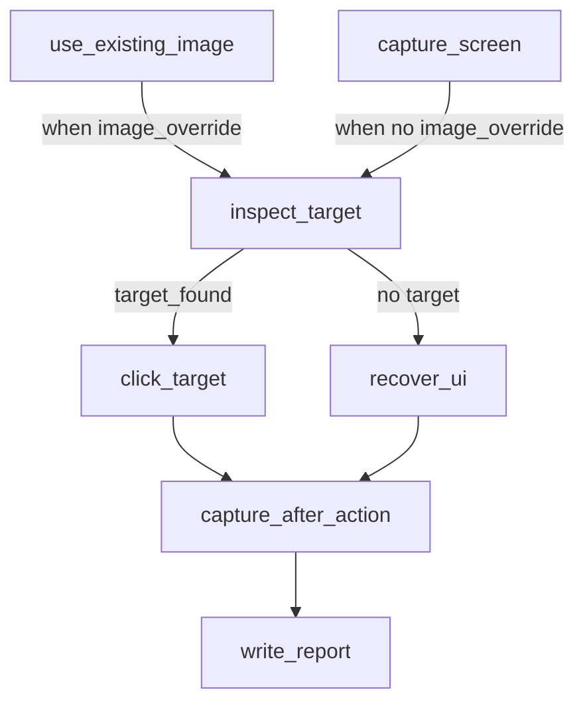

# 🎯 11 · Operador visual tri-modo (OCR / visión / híbrido)

> Caso visual más completo: imagen existente o captura, análisis OCR / visión / híbrido, click o recuperación, evidencia, dry-run para pruebas seguras.

| | |
| --- | --- |
| **Familia** | pantalla / escritorio |
| **Plataforma** | 🟢 Windows · 🟢 Linux · 🟢 macOS |
| **Internet** | ⚠️ requerido si `vision_provider != "mock"` |
| **Modifica el sistema** | ⚠️ clicks reales (a menos que `ui_dry_run: true`) |

---

## 🎯 Para qué sirve

- 🧠 Comparar OCR local vs visión multimodal.
- 🛡️ Probar automatización visual **sin tocar UI** mediante `image_override` + `ui_dry_run`.
- 🎯 Decidir click sobre objetivo detectado con prioridad configurable.
- 📋 Documentar diagnósticos paso a paso.

## 🧭 Flujo paso a paso



| # | Paso | Acción | Qué hace |
| --- | --- | --- | --- |
| 1a | `use_existing_image` (si `image_override`) | `vision.select_image` | Reusa imagen existente. |
| 1b | `capture_screen` (si NO hay override) | `screen.capture_screenshot` | Captura real. |
| 2 | `inspect_target` | `vision.inspect_screen_target` | Núcleo: OCR y/o visión multimodal según `analysis_mode`, prioridad con `prefer_source`, fallback a `fallback_bbox`. Devuelve `target_found`, `target_bbox`, `selected_source`, `decision`, `diagnostics`. |
| 3 | `click_target` (si target) | `ui.click_bbox` | Click real o dry-run según `ui_dry_run`. |
| 4 | `recover_ui` (si NO target) | `ui.hotkey` | Hotkey de recuperación. |
| 5 | `capture_after_action` (omitible) | `screen.capture_screenshot` | Evidencia post-acción. |
| 6 | `write_report` | `filesystem.write_json` | Reporte con `effective_config`. |

## ⚙️ Configuración

```json
{
  "analysis_mode": "hybrid",
  "query_text": "Guardar",
  "vision_provider": "mock",
  "vision_model": "",
  "vision_endpoint": "",
  "vision_prompt": "",
  "vision_api_key_env": "OPENAI_API_KEY",
  "prefer_source": "ocr",
  "fallback_bbox": {"left": 40, "top": 40, "width": 220, "height": 80},
  "recovery_hotkey": ["esc"],
  "ui_dry_run": true,
  "skip_after_capture": true,
  "image_override": ""
}
```

| Clave | Valores | Efecto |
| --- | --- | --- |
| `analysis_mode` | `ocr` · `vision` · `hybrid` | Qué fuentes usa. |
| `query_text` | string | Lo que se busca / describe. |
| `vision_provider` | `mock` · `openai_compatible` · `ollama` | Backend. `mock` = sin red. |
| `vision_model` | string | Ej `gpt-4o-mini`, `llava:latest`. |
| `vision_endpoint` | URL | Endpoint compatible OpenAI / Ollama. |
| `vision_api_key_env` | nombre env var | Para leer la API key sin hardcode. |
| `prefer_source` | `ocr` · `vision` | En `hybrid`, qué gana cuando ambos detectan. |
| `fallback_bbox` | `{left,top,width,height}` | Bbox usado si nada detecta. |
| `recovery_hotkey` | array | Hotkey para `recover_ui`. |
| `ui_dry_run` | bool | **🛡️ Si true, clicks/hotkeys NO se envían**. |
| `skip_after_capture` | bool | Omite captura final. |
| `image_override` | path | Si se da, usa esa imagen en lugar de capturar. |

## 📋 Requisitos

- ✅ Python 3.10+, `Pillow`, `mss`, `pyautogui`, `pytesseract`.
- ⚠️ Tesseract si `analysis_mode ∈ {ocr, hybrid}`.
- ⚠️ Endpoint y API key si `vision_provider != "mock"`.
- ✅ Sesión gráfica si `image_override` no está definido.

## 🛡️ Sandbox sugerido

```json
{
  "allowed_actions": [
    "screen.capture_screenshot", "vision.select_image",
    "vision.inspect_screen_target", "ui.click_bbox",
    "ui.hotkey", "filesystem.write_json"
  ],
  "required_secrets": ["OPENAI_API_KEY"],
  "allowed_paths": ["output/screenshots", "output/reports", "tests/assets"],
  "max_runtime_seconds": 60
}
```

## ⚠️ Limitaciones

- ❌ El proveedor `mock` NO entiende contenido — respuesta plausible pero arbitraria.
- ❌ Tesseract en español: precisión variable.
- ❌ El bbox de visión depende del modelo — varía bastante.
- ⚠️ Si `vision_endpoint` falla, queda en `diagnostics` y la corrida sigue.

## 🎮 Control que tienes

| Aspecto | Cómo se cambia |
| --- | --- |
| Modo de análisis | `analysis_mode` |
| Prioridad híbrida | `prefer_source` |
| Probar sin tocar UI | `ui_dry_run: true` + `image_override: "tests/assets/sample_ui.png"` |
| Sin captura final | `skip_after_capture: true` |
| Provider de visión | `vision_provider` + endpoint + model + key env |
| Bbox de respaldo | `fallback_bbox` |

## 📤 Salidas

- 🖼️ `output/screenshots/tri_mode_<ts>.png` (si captura)
- 🖼️ `output/screenshots/tri_mode_after_<ts>.png` (si no `skip_after_capture`)
- 📊 `output/reports/screen_tri_mode_operator_<ts>.json` con `analysis` (incluyendo `ocr`, `vision`, `diagnostics`, `selected_source`), `effective_config`, `click_result`/`recovery_result`.

## ⚡ Ejecución

```bash
# Modo 100% seguro (default de context.example.json):
flujo run flows/11_screen_tri_mode_operator

# Para producción:
# Edita configs/11_screen_tri_mode_operator.json:
#   "ui_dry_run": false, "image_override": "", "skip_after_capture": false
# Y luego corre.
```
